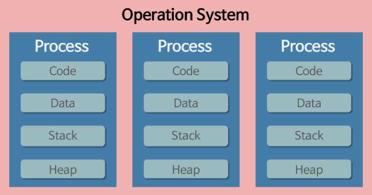
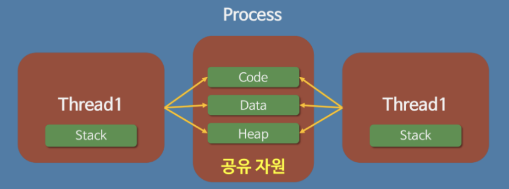

# 💁‍♂️ 개념(Process & Thread)

## 프로세스란?
- 프로세스(process)란 실행 중인 프로그램(program)입니다. 프로그램을 실행하면 OS로부터 실행에 필요한 자원(메모리)을 할당받아 프로세스가 됩니다.

> Program + PCB = Process

- PCB(Process Control Block)는 운영체제가 프로세스를 제어하기 위해 정보를 저장해 놓는 곳으로, 프로세스의 상태 정보를 저장하는 자료구조
- 프로세스가 생성될 때마다 고유의 PCB가 생성되고, 프로세스가 완료되면 PCB도 함께 제거 됩니다.
- => PCB를 이용하여 CPU에서 문맥 교환(Context Switch)을 합니다.

## 스레드란?
- 프로세스 내에서 실행하는 단위입니다. 좀 더 자세히 말하면 CPU 스케줄러가 CPU에 전달하는 일 한 개가 스레드입니다.
- 프로세스가 code, data, heap 영역을 공유하여 사용합니다. stack만 스레드 별로 가지게 됩니다.

## 멀티프로세스 vs 멀티 스레드

### 멀티 프로세스
- 장점
  - 독립적인 메모리 공간을 가지므로, 한 프로세스가 비정상적으로 종료되어도 다른 프로세스에 영향을 주지 않습니다. 즉, 프로그램의 안전성이 높습니다.
  - 프로그램을 병렬적으로 CPU에 분산 할당 하여 빠르게 처리할 수 있습니다.
- 단점
  - 컨텍스트 스위칭 과정에서 성능의 저하가 발생합니다.
  - 멀티 프로세스는 독립적인 메모리 공간을 가지므로 자원 공유에서 비효율적입니다.

### 멀티 스레드
- 장점
  - 컨텍스트 스위칭 과정에서 멀티 프로세스보다 비용이 낮습니다. 스택, 레지스터 영역에서만 컨텍스트 스위칭을 하면 되기 때문입니다.
  - code, data, heap 영역을 공유하기 때문에 자원의 효율적인 활용이 가능합니다.
- 단점
  - 여러 개의 스레드 중 하나의 스레드에서 문제가 발생하면 다른 스레드에서도 영향을 받기 때문에 프로그램이 종료될 수 있습니다.(예외 처리 또는 스레드 풀을 통해 극복은 가능합니다.)
  - 자원을 공유하기 때문에 공유 자원에 동시에 접근할 수 있고, 이는 동기화 문제를 발생시킬 수 있습니다. 

# 💁‍♂️질문

## Q. 운영체제란?
- 운영체제란 컴퓨터 시스템의 자원들을 효율적으로 관리하고, 사용하자 컴퓨터를 편리하게 사용할 수 있도록 도와주는 여러 프로그램들의 모임입니다.
- 운영체제에는 윈도우, 맥, 리눅스 등이 있습니다.

## Q. 프로세스와 스레드의 차이
- 우선 프로세스는 우리가 사용하는 프로그램이 운영체제의 의해 메모리에 올라가고 PCB를 생성한 동적인 상태를 말합니다. 그 안에서 스레드가 CPU 스케줄링에 따라 프로세스에 자원을 공유하며 코드를 실행합니다. 스레드는 프로세스의 코드/데이터/힙 영역을 공유하여 사용하여 프로세스를 여러개 사용하는 것보다 스레드를 사용하는 것이 더 효율적입니다. 하지만 자원을 공유한다는 것은 병목현상을 발생 시킬수 있기 때문에 락을 통한 동기화 작업을 신경써야 합니다.

## Q. 멀티 프로세스 대신 멀티 스레드를 사용하는 이유
- 프로세스보다 스레드를 사용하는 것이 더 가볍고 효율적이기 때문입니다. code, data, heap 영역을 공유하기 때문에 자원을 효율적으로 사용할 수 있습니다.

## Q. 스레드에 스택을 독립적으로 할당하는 이유?
- 스택은 함수 호출 시 전달되는 인자, 작업 이후 돌아갈 주소값 등을 저장하는 메모리 공간입니다. 이는 독립적인 실행 흐름을 가지고 있어야 하기 때문에 독립적으로 할당합니다.

## Q. PC레지스터를 스레드마다 독립적으로 할당하는 이유?
- PC 레지스터는 스레드가 명령어의 어디까지 수행했는지를 나타냅니다. 스레드는 CPU를 할당받았다가 스케줄러에 의해 다시 선점당하기 때문에 명령어가 연속적으로 수행되지 못하고, 어느 부분까지 수행했는지 기억할 필요가 있어 독립적으로 할당합니다.

## Q. 자바 스레드란?
- 자바에서는 프로세스가 존재하지 않고 스레드만 존재합니다. JVM에 의해 스케줄링되는 단위입니다.

## Q. Thread-safe가 뭐에여?
- 멀티 스레드 프로그래밍 환경에서 하나의 함수가 한 스레드로부터 호출되어 실행 중일때, 다른 스레드가 그 함수를 호출하여 동시에 함께 실행되더라도 각 스레드의 결과가 올바르다는 것을 의미합니다.

## Q. 세마포어와 뮤텍스를 설명해주세요.
- 뮤텍스는 공유자원을 한 번에 한 개의 스레드만 접근 가능하게 하여 스레드의 안정성을 보장하고 세마포어는 여러개의 공유자원을 여러개의 프로세스가 접근 가능하게 관리하는 방법입니다.
