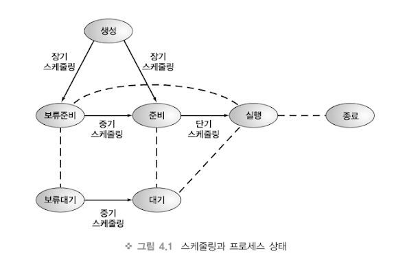
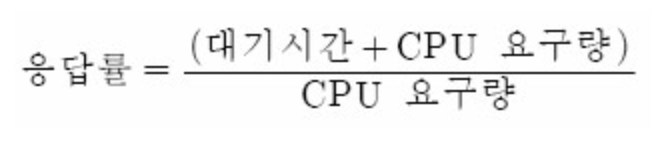
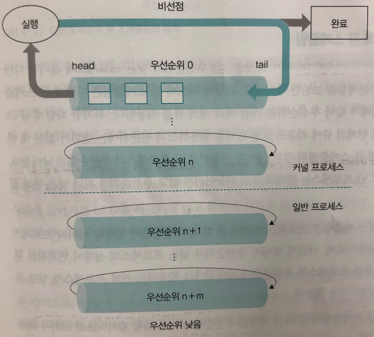

## Scheduling 스케줄링

## 스케줄러란?

스케줄러는 여러 프로세스 상황을 고려하여 **cpu가 프로세스에게 시스템 자원을 할당하는 작업**을 의미합니다.

스케줄링은 CPU에서 자원을 효율적으로 사용하기 위한 목적으로 사용됩니다.

## 스케줄링 단계

- 장기 스케줄링
  - 디스크에서 메모리로 올릴 프로세스를 결정하는 단계입니다. 디스크의 프로세스 큐에 있는 프로세스들을 선택해 메모리로 올려 준비상태로 만듭니다. 작업중인 프로세스의 수를 제어합니다.
- 중기 스케줄링
  - 보류 상태의 프로세스들 중에서 어느 프로세스에게 메모리를 할당할 것인가를 결정합니다.
- 단기 스케줄링
  - 준비 상태의 프로세스들 중에서 어느 프로세스에게 CPU를 할당할지 결정합니다.

## PCB
PCB는 운영체제가 작업을 프로세스 단위로 관리할 때 사용하는 실제적인 자료구조입니다.

프로세스 상태 및 실행에 필요한 모든 정보를 담고 있습니다.

- Pointer : 부모 프로세스에 대한 포인터, 자식 프로세스에 대한 포인터 등의 참조 포인터

- Process State : 프로세스의 현재 상태 (running, ready, waiting)

- Process Number : 프로세스가 생성될 때 부여받는 고유 식별자

- Program Counter : 프로세스가 다음에 수행해야할 명령어의 주소

## Context Switching

현재 프로세스가 작업중인 CPU에서 인터럽트나 시스템콜이 발생하여 다른 작업을 수행해야할 때,

**현재 프로세스의 상태 정보를 저장하고 작업해야할 다른 프로세스의 상태 정보를 받아오는 것**을 의미합니다.

=> CPU가 현재 작업중인 상태에서 다른 작업을 진행하기 위해 이전의 프로세스의 상태를 PCB에 보관하고 다른 프로세스의 정보를 PCB에서 읽어 레지스터에 적재하는 과정이다.

## Context Switching 장단점
- 장점
  - 문맥 교환을 통해 멀티 태스킹이 가능하다.
  - (멀티 태스킹 : 다수의 프로세스가 하나의 CPU 자원을 나누어 사용하는 것)
- 단점
  - 문맥 교환 중에는 다른 작업을 할 수 없다.

## Context Swiching이 발생하는 시점
1. 멀티 태스킹(멀티태스킹 환경에서 프로세스 전환 관정에서 발생)
2. 인터럽트 처리
3. 사용자 및 커널 모드 전환

## 스케줄링 유형

### 비선점 스케줄링
우선순위와 상관없이 CPU로 부터 자원을 할당받은 경우 해당 프로세스가 반납되기 전까지 계속해서 사용할 수 있는 방식입니다.

**[유형]**
- FCFS(First Come First Sevice)
- SJF(Shortest Job First)
- HRN(Highest Response Ratio Next)

### 선점 스케줄링
우선순위를 적용하여 우선순위가 더 높은 프로세스가 있을 경우 해당 프로세스가 CPU를 선점하게 되는 방식입니다.

**[유형]**
- RR(Round Robin)
- SRT(Shortest Remaining Time)
- 다단계 큐 스케줄링

#### FCFS(비선점)
이 스케줄링 방식은 FIFO 스케줄링이라고도 불립니다.

준비 큐에 먼저 도착한 순서대로 프로세스를 할당하고 끝날 때까지 CPU를 독점하는 비선점 스케줄링 알리즘입니다.

무조건 들어온 순서대로 작업을 처리하기 때문에 뒤에 도착한 프로세스들이 무한 대기를 할 수 있다.

#### SJF(비선점)
가장 짧은 작업 시간을 가지는 프로세스에게 CPU를 할당하는 알고리즘입니다.

짧은 작업 시간을 먼저 작업하기 때문에 작업 시간이 긴 프로세스가 아사현상이 발생할 수 있다.

> 아사현상 : 긴 작업 시간을 가진 프로세스를 평생 실행되지 못할 수 있다.(불공평)

#### HRN(비선점)
작업 시간을 고려해 SJF 스케줄링에서 발생할 수 있는 아사현상을 해결하기 위해 만들어졌습니다. 

서비스를 받기 위해 기다린 시간과 cpu 사용 시간을 고려한 스케줄링입니다.

응답률이 가장 높은 프로세스에게 우선 순위를 주는 알고리즘입니다.

#### RR(선점)
FCFS 방식에서 타임 슬라이스가 추가된 버전입니다.

프로세스가 할당 받은 시간(타임 슬라이스) 동안 작업을 하다가 시간내 완료하지 못하면 준비 큐의 맨 뒤로 가서 자기 차례를 기다리는 방식입니다.

#### SRT(선점)

준비 큐에서 완료까지 남은 작업 시간이 가장 짧은 것을 먼저 실행시켜주는 방식입니다.

실행 도중에 남은 시간이 더 적은 프로세스가 준비 큐에 들어오면 현재 실행 중인 것을 중단하고 새 프로세스에게 CPU를 할당하는 알고리즘입니다.

현재 실행중인 프로세스보다 계속 짧은 시간의 프로세스가 들어온다면 잦은 문맥교환이 발생한다는 단점이 있습니다.

#### 다단계 큐 스케줄링

우선순위에 따라 준비 큐를 여러개 사용하는 알고리즘입니다. 

RR방식의 큐가 다단계로 나눠져 있고, 상단의 큐에 있는 프로세스의 작업이 끝나야 다음 우선순위 큐의 작업이 시작됩니다.

각 큐는 독립적인 스케줄링 알고리즘을 가질 수 있어 적절한 비율로 설정해야합니다. 예를 들면, 전면 프로세스 80%에 RR 방식, 후면 프로세스 20%에 FCFS 방식

