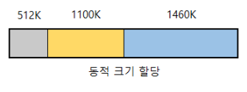

# 메모리 관리 전략

## 교착 상태 & 기아 상태

### 교착 상태(Dead Lock)
두 개 이상의 프로세스나 스레드가 서로 자원을 얻지 못해서 다음 처리를 하지 못하는 상태를 말합니다.

무한정 다음 자원을 기다리게 되는 상태입니다.

한정된 자원을 여러 곳에서 사용하려고 할 때 발생합니다.

### 교착 생태 발생 조건
- 상호배제 : 공유 자원의 사용은 한 번에 한 프로세스만 사용가능합니다. 여러 프로세스가 접근할 수 없습니다.
- 점유대기 : 공유자원에 접근중인 한 프로세스가 접근해제를 하지 않고 다른 자원에 접근하려고 기다립니다.
- 비선점 : 한 프로세스가 자원의 사용을 끝낼 때까지 그 자원을 뺏을 수 없습니다.
- 순환대기 : 각 프로세스는 순환적으로 다음 프로세스가 요구하는 자원을 자지고 있습니다.

위 네가지의 조건 중 하나라도 만족하지 않는다면 교착상태는 일어나지 않습니다.

### 교착 상태 처리 방법

1. 교착 상태 예방
   - 데드락의 발생조건 4가지 중 하나라도 발생하지 않게 하는 것이 데드락을 예방하는 방법입니다.
   - 예방을 하는 방식은 자원 낭비가 심하는다는 단점이 존재합니다.
2. 교착 상태 회피
   - 데드락이 발생시 피해가는 방법입니다.
   - 대표적으로 은행원 알고리즘(Banker Algorithm)이 존재합니다.
3. 교착 상태 탐지 및 회복
   - 교착 상태가 되도록 허용하고, 교착 상태를 탐지하고 회복하는 알고리즘입니다.
   - 자원 할당 그래프를 통해 교착 상태를 탐지합니다.
   - 교착 상태가 발생했다면, 발생한 프로세스를 종료하거나 자원을 선점해 교착 상태가 해결할 때까지 그 자원을 다른 프로세스에 할당해주는 방법이 존재합니다.

### 기아 상태

특정 프로세스의 우선순위가 낮아서 원하는 자원을 계속 할당 받지 못하는 상태를 의미합니다.

### 교착상태와 기와상태 차이
교착 상태는 프로세스가 자원을 얻지 못해 다음 처리를 못하는 상태를 말하고 기아 상태는 프로세스가 원하는 자원을 계속 할당 받지 못하는 상태를 의미합니다.

즉 교착 상태는 여러 프로세스가 동일한 자원 점유를 원할 때 발생하고 기아 상태를 여러 프로세스가 자원을 점유하기 위해 경쟁할 때 특정 프로세스가 우선순위가 낮아 계속 자원을 할당받지 못하는 상태를 의미합니다.

### Aging 이란?
에이징은 자원 스케줄링 시스템에서 기아 상태를 방지하기 위해 사용되는 기술입니다.

특정 프로세스의 우선순위가 낮아 무한정 기다리게 되는 경우, 한 번 양보하거나 기다린 시간에 시간에 비례해 일정 시간이 지나면 우선순위를 한 단계식 높여 가까운 시간 안에 자원을 할당받도록 하는 기법을 말합니다.

## 메모리 관리 전략
성능을 향상시키기 위해서는 주 메모리에 여러 개의 프로세스가 올라와 있어야 합니다. 

즉, 여러 프로세스들이 동시에 주 메모리를 공유해야 하는 상황입니다.

따라서 메모리 용량이 증가함에 따라 프로그램의 크기 또한 계속 증가하고 있기 때문에 메모리는 언제나 부족합니다.

제한된 물리 메모리의 효율적인 사용과 메모리 참조 방식을 제공하기 위한 전략이 등장하게 됩니다.

## 메모리 관리 정책
- 가져오기 정책(fetch policy) : 필요로 하는 데이터를 언제 메모리로 가져올지 결정
- 배치 정책(placement policy) : 가져온 데이터를 메모리 어느 위치에 올려놓을지 결정
- 교체 정책(replacement policy) : 어떤 데이터를 메모리에서 내보내고 가져올지 결정

### 가져오기 정책
보조 기억 장치에 보관중인 데이터를 언제 주기억장치로 옮길 것인지 결정합니다.

- 요구 적재(demand fetch) : 요청시 메모리에 적재
- 예상 적재(anticipatory fetch) : 미리 예상하여 메모리에 적재

### 배치 정책
새로 반입되는 데이터를 언제 주기억장치의 어느 위치에 배치할지를 결정하는 전략입니다.

- 최조 적합 전략(first-fit strategy)
  - 사용 가능한 공간의 첫 번째 영역에 배치
  - 장점 : 가용 공간 정렬이 불필요합니다.
  - 단점 : 큰 공간을 쪼개어 사용하게 될 수 있습니다.
- 최적 적합 전략(best-fit strategy)
  - 사용 가능한 공간 중 가장 작은 영역을 선택하여 배치
  - 장점 : 큰 공간을 쪼개어 쓰는 일이 적습니다.
  - 단점 : 정렬이 필요합니다. 작은 틈새 공간이 많이 발생
- 최악 적합 전략(worst-fit strategy)
  - 사용 가능한 공간 중 가장 큰 영역을 선택하여 배치
  - 장점 : 남은 공간이 커 다른 프로세스가 유용하게 사용 가능
  - 단점 : 정렬 필요, 공간 낭비 발생

### 교체 전략
주기억장치의 영역이 모두 사용중일 때, 사용중인 영역중 어느 영역이랑 교체해서 사용할 것인지 결정하는 전략입니다.

종류에는 FIFO, OPT, LRU, LFU, NUR, SCR 등이 있습니다.

## 페이징과 세그먼트

### 사용 이유
다중 프로그래밍 시스템에 여러 프로세스를 수용하기 위해 주기억장치를 동적 분할하는 메모리 관리 작업이 필요하기 때문입니다.

### 메모리 관리 기법

1. 연속 메모리 관리
    - 프로그램 전체가 하나의 커다란 공간에 연속적으로 할당되어야 합니다.
    - 고정 분할 기법 : 메모리를 동일한 크기로 미리 나누어 각 분할에 하나의 프로세스를 적재하여 실행하도록 하는 방식
   
    
    - 프로그램의 크기를 고려하여 파티션의 크기 및 개수를 동적으로 바꾸는 방식
   
    

2. 불연속 메모리 관리
   - 프로그램의 일부가 서로 다른 주소 공간에 할당될 수 있어야 합니다.
   - 페이지 : 고정 사이즈의 작은 프로세스 조각
   - 프레임 : 페이지 크기와 같은 주기억장치 메모리 조각
   - 단편화 : 메모리 단편화란 메모리 공간이 비효율적으로 사용되어 저장 공간이 낭비되는 것을 말합니다.
   - 내부 단편화 : 파티션의 크기가 프로세스의 크기보다 커서 메모리가 남지만, 남은 공간은 다른 프로세스가 사용하지 못해 낭비되는 현상을 의미합니다.
   - 외부 단편화 : 남아있는 메모리 공간이 실행하고자 하는 프로세스의 크기보다 크지만 메모리 공간이 연속적이지 않는 공간에 존재하여 프로세스를 실행하지 못하는 현상
   - 페이징 방식
     - 페이징은 플레임을 고정된 페이지 단위로 나누고 프로세스를 연속되지 않는 공간에 저장하는 메모리 관리 기법입니다.
     - 외부 단편화를 해야 하였지만 내부 단편화를 해결하지 못합니다.
   - 세그멘테이션
     - 메모리를 서로 크기가 다른 논리적인 블록 단위인 '세그먼트(segment)'로 분할하고 메모리를 할당하여 물리 주소를 논리 주소로 변환하는 것을 말합니다.
     - 가변 크기로 프로세스를 적재하기 때문에 내부 단편화 문제를 해결하였지만 외부 단편화 문제가 발생할 수 있습니다.
