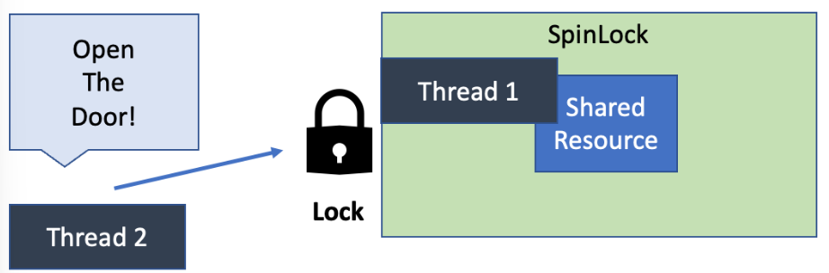

# 메모리 관리 전략

## 교착 상태 & 기아 상태

### 교착 상태(Dead Lock)
두 개 이상의 프로세스나 스레드가 서로 자원을 얻지 못해서 다음 처리를 하지 못하는 상태를 말합니다.

무한정 다음 자원을 기다리게 되는 상태입니다.

한정된 자원을 여러 곳에서 사용하려고 할 때 발생합니다.

### 교착 생태 발생 조건
- 상호배제 : 공유 자원의 사용은 한 번에 한 프로세스만 사용가능합니다. 여러 프로세스가 접근할 수 없습니다.
- 점유대기 : 공유자원에 접근중인 한 프로세스가 접근해제를 하지 않고 다른 자원에 접근하려고 기다립니다.
- 비선점 : 한 프로세스가 자원의 사용을 끝낼 때까지 그 자원을 뺏을 수 없습니다.
- 순환대기 : 각 프로세스는 순환적으로 다음 프로세스가 요구하는 자원을 자지고 있습니다.

위 네가지의 조건 중 하나라도 만족하지 않는다면 교착상태는 일어나지 않습니다.

### 교착 상태 처리 방법

1. 교착 상태 예방
   - 데드락의 발생조건 4가지 중 하나라도 발생하지 않게 하는 것이 데드락을 예방하는 방법입니다.
   - 예방을 하는 방식은 자원 낭비가 심하는다는 단점이 존재합니다.
2. 교착 상태 회피
   - 데드락이 발생시 피해가는 방법입니다.
   - 대표적으로 은행원 알고리즘(Banker Algorithm)이 존재합니다.
3. 교착 상태 탐지 및 회복
   - 교착 상태가 되도록 허용하고, 교착 상태를 탐지하고 회복하는 알고리즘입니다.
   - 자원 할당 그래프를 통해 교착 상태를 탐지합니다.
   - 교착 상태가 발생했다면, 발생한 프로세스를 종료하거나 자원을 선점해 교착 상태가 해결할 때까지 그 자원을 다른 프로세스에 할당해주는 방법이 존재합니다.

### 교착 상태 예방 알고리즘
다중프로그래밍으로 여러 작업을 동시에 실행가능한 환경이 됐다. 이러한 환경은 탁월한 성능 및 메모리를 자랑한다. 하지만, 그에 대한 대가로 공유자원을 여러 프로세스, 혹은 스레드에서 사용하게 되어 데드락(교착 상태)이 자주 발생하게 되는`동기화 문제`가 자주 발생하게 된다.

OS에서의 데드락을 발생시키는 원인은 상호배제, 점유대기, 비선점, 순환대기가 있는데, 이 4가지가 모두 지켜지지 않으면 데드락이 발생한다. **뮤텍스, 스핀락, 세마포어 방식은 위 4가지 조건 중 상호배제를 준수하여 데드락이 발생되지 않도록 하는 방법**이다.

#### 뮤텍스
**여러 스레드를 실행하는 환경에서 자원 접근에 대한 제한을 위한 메커니즘**이다.

그림처럼 **스레드 1이 key에 해당하는 어떠한 오브젝트를 가져 뮤텍스 객체에 접근하여 공유 자원을 이용하는 중**이라 하자.

스레드 1이 임계 구역에 접근하여 공유 자원을 사용중이기 때문에 상태를 **lock**으로 바꿔주었다. 

스레드 2는 현재 뮤텍스 객체의 상태가 lock이므로 **해당 공유 자원을 이용하지 못하고 block되어 sleep 상태로 대기**하게 된다. 이후에 뮤텍스 객체의 상태가 unlock이 되면 wakeup 하여 뮤텍스 객체 접근 권한을 요청하게 된다.

이렇게 임계 구역에 접근하는 메커니즘을 뮤텍스라고 한다.

#### 스핀락

뮤텍스에서 설명한 예시와 비슷하지만, **스레드2가 sleep 상태로 대기하는 것이 아닌 접근 권한을 계속해서 요청**한다.

그렇기 때문에 스레드2가 **busy-waiting 상태**에 있다고 말한다. 

싱글코어 프로세스에서는 공유자원 관리와 busy-waiting 스레드 관리를 동시에 처리할 수 없다. 따라서 **스핀락 방법은 멀티코어 프로세스에서만 사용될 수 있는 방법**이다.

또한, **컨텍스트 스위칭(Context Switching) 시간이 짧을수록 스핀락 방식이 유리**하다. 점유를 포기하는 것보다 그냥 기다리는 시간이 더 짧다는 의미이기 때문이다.

#### 세마포어
공유 자원을 하나의 스레드만 접근할 수 있게 하는 방식이었던 뮤텍스와 달리, **세마포어는 지정된 개수만큼의 스레드가 동시에 접근하도록 동기화할 수 있게 하는 방식**을 의미한다.

위 그림은 3개의 스레드까지 공유 자원에 접근할 수 있게 세마포어가 지정된 예시이다.

**스레드는 공유 자원을 사용하려 접근할 때 P 함수가 실행되며, 세마포어의 숫자를 1 감소시킨다.**

**세마포어 숫자가 음수일 경우, 해당 프로세스 또는 스레드(스레드4, 스레드5)는 공유 자원을 이용할 수 없다는 의미이므로 대기 큐에 넣어 block된다.**

스레드 1이 **공유 자원을 사용하지 않는 상태가 될 때 V 함수를 실행한다. V 함수가 실행되면 세마포어 숫자를 1 증가**시킨다. 

스레드 1이 V 함수를 실행하면서 나오고, 대기 큐에 있던 스레드 4가 공유 자원을 사용하는 것을 확인할 수 있다.

중요한 점은, **세마포어는 뮤텍스가 될 수도 있다는 것**이다.

1개의 프로세스 또는 스레드만 공유 자원을 사용할 수 있게 하면 뮤텍스처럼 이용이 가능하다.

이러한 특성 때문에 **뮤텍스를 이진 세마포어라 하기도 한다.**

또한 **뮤텍스 기법은 잠금 메커니즘인 lock을 가지는 형태로 자원을 소유할 수 있지만, 세마포어 기법은 신호 메커니즘으로 정수값을 이용하여 프로세스의 리소스 해제 및 획득 여부를 관리**할 수 있다. (뮤텍스는 객체, 세마포어는 정수값이다.)

그리고 뮤텍스 기법은 특정 프로세스가 lock을 획득하면 동일 프로세스만 lock을 해제할 수 있고, 세마포어 기법에서는 동일 프로세스가 아닌 모든 프로세스에서 값을 변경할 수 있다.

### 기아 상태

특정 프로세스의 우선순위가 낮아서 원하는 자원을 계속 할당 받지 못하는 상태를 의미합니다.

### 교착상태와 기와상태 차이
교착 상태는 프로세스가 자원을 얻지 못해 다음 처리를 못하는 상태를 말하고 기아 상태는 프로세스가 원하는 자원을 계속 할당 받지 못하는 상태를 의미합니다.

즉 교착 상태는 여러 프로세스가 동일한 자원 점유를 원할 때 발생하고 기아 상태를 여러 프로세스가 자원을 점유하기 위해 경쟁할 때 특정 프로세스가 우선순위가 낮아 계속 자원을 할당받지 못하는 상태를 의미합니다.

### Aging 이란?
에이징은 자원 스케줄링 시스템에서 기아 상태를 방지하기 위해 사용되는 기술입니다.

특정 프로세스의 우선순위가 낮아 무한정 기다리게 되는 경우, 한 번 양보하거나 기다린 시간에 시간에 비례해 일정 시간이 지나면 우선순위를 한 단계식 높여 가까운 시간 안에 자원을 할당받도록 하는 기법을 말합니다.

## 메모리 관리 전략
성능을 향상시키기 위해서는 주 메모리에 여러 개의 프로세스가 올라와 있어야 합니다. 

즉, 여러 프로세스들이 동시에 주 메모리를 공유해야 하는 상황입니다.

따라서 메모리 용량이 증가함에 따라 프로그램의 크기 또한 계속 증가하고 있기 때문에 메모리는 언제나 부족합니다.

제한된 물리 메모리의 효율적인 사용과 메모리 참조 방식을 제공하기 위한 전략이 등장하게 됩니다.

## 메모리 관리 정책
- 가져오기 정책(fetch policy) : 필요로 하는 데이터를 언제 메모리로 가져올지 결정
- 배치 정책(placement policy) : 가져온 데이터를 메모리 어느 위치에 올려놓을지 결정
- 교체 정책(replacement policy) : 어떤 데이터를 메모리에서 내보내고 가져올지 결정

### 가져오기 정책
보조 기억 장치에 보관중인 데이터를 언제 주기억장치로 옮길 것인지 결정합니다.

- 요구 적재(demand fetch) : 요청시 메모리에 적재
- 예상 적재(anticipatory fetch) : 미리 예상하여 메모리에 적재

### 배치 정책
새로 반입되는 데이터를 언제 주기억장치의 어느 위치에 배치할지를 결정하는 전략입니다.

- 최조 적합 전략(first-fit strategy)
  - 사용 가능한 공간의 첫 번째 영역에 배치
  - 장점 : 가용 공간 정렬이 불필요합니다.
  - 단점 : 큰 공간을 쪼개어 사용하게 될 수 있습니다.
- 최적 적합 전략(best-fit strategy)
  - 사용 가능한 공간 중 가장 작은 영역을 선택하여 배치
  - 장점 : 큰 공간을 쪼개어 쓰는 일이 적습니다.
  - 단점 : 정렬이 필요합니다. 작은 틈새 공간이 많이 발생
- 최악 적합 전략(worst-fit strategy)
  - 사용 가능한 공간 중 가장 큰 영역을 선택하여 배치
  - 장점 : 남은 공간이 커 다른 프로세스가 유용하게 사용 가능
  - 단점 : 정렬 필요, 공간 낭비 발생

### 교체 전략
주기억장치의 영역이 모두 사용중일 때, 사용중인 영역중 어느 영역이랑 교체해서 사용할 것인지 결정하는 전략입니다.

종류에는 FIFO, OPT, LRU, LFU, NUR, SCR 등이 있습니다.

## 페이징과 세그먼트

### 사용 이유
다중 프로그래밍 시스템에 여러 프로세스를 수용하기 위해 주기억장치를 동적 분할하는 메모리 관리 작업이 필요하기 때문입니다.

### 메모리 관리 기법

1. 연속 메모리 관리
    - 프로그램 전체가 하나의 커다란 공간에 연속적으로 할당되어야 합니다.
    - 고정 분할 기법 : 메모리를 동일한 크기로 미리 나누어 각 분할에 하나의 프로세스를 적재하여 실행하도록 하는 방식
   
    
    - 프로그램의 크기를 고려하여 파티션의 크기 및 개수를 동적으로 바꾸는 방식
   
    

2. 불연속 메모리 관리
   - 프로그램의 일부가 서로 다른 주소 공간에 할당될 수 있어야 합니다.
   - 페이지 : 고정 사이즈의 작은 프로세스 조각
   - 프레임 : 페이지 크기와 같은 주기억장치 메모리 조각
   - 단편화 : 메모리 단편화란 메모리 공간이 비효율적으로 사용되어 저장 공간이 낭비되는 것을 말합니다.
   - 내부 단편화 : 파티션의 크기가 프로세스의 크기보다 커서 메모리가 남지만, 남은 공간은 다른 프로세스가 사용하지 못해 낭비되는 현상을 의미합니다.
   - 외부 단편화 : 남아있는 메모리 공간이 실행하고자 하는 프로세스의 크기보다 크지만 메모리 공간이 연속적이지 않는 공간에 존재하여 프로세스를 실행하지 못하는 현상
   - 페이징 방식
     - 페이징은 플레임을 고정된 페이지 단위로 나누고 프로세스를 연속되지 않는 공간에 저장하는 메모리 관리 기법입니다.
     - 외부 단편화를 해야 하였지만 내부 단편화를 해결하지 못합니다.
   - 세그멘테이션
     - 메모리를 서로 크기가 다른 논리적인 블록 단위인 '세그먼트(segment)'로 분할하고 메모리를 할당하여 물리 주소를 논리 주소로 변환하는 것을 말합니다.
     - 가변 크기로 프로세스를 적재하기 때문에 내부 단편화 문제를 해결하였지만 외부 단편화 문제가 발생할 수 있습니다.
