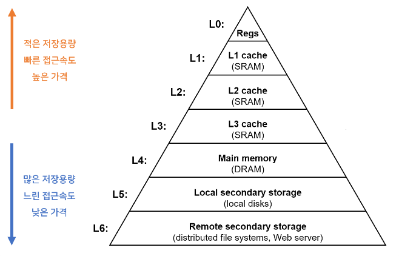
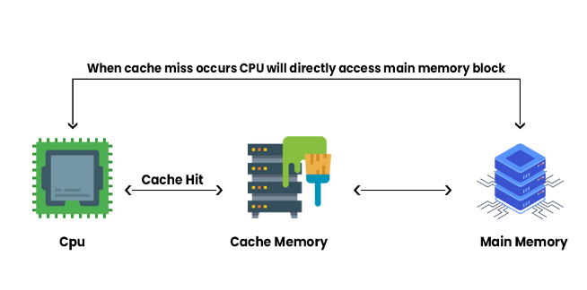
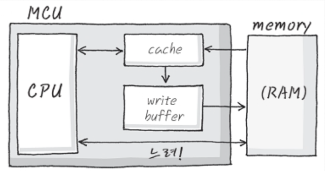

# 캐시

## 캐시란
메인 메모리와 CPU 사이에 존재하여 자주 쓰는 데이터를 저장합니다. 따라서 데이터를 읽기 위해 메인 메모리에 접근하지 않아도 됩니다.

자주 사용하는 데이터를 캐쉬에 저장하여 데이터 접근 시간을 줄여 CPU 성능을 향상시킵니다.

캐시는 휘발성 메모리입니다.

## 캐시의 지역성
CPU는 메모리에 접근하기 전에 먼저 캐시에 방문하여 필요한 데이터가 있는지 확인합니다.
**이때 CPU가 캐시에서 원하는 데이터를 찾으면 Cache Hit, 못 찾으면 Cache Miss 입니다.**

이때 적중율(Hit rate)을 극대화 시키기 위해 데이터 지역성의 원리를 사용합니다.
**지역성이란 동일한 값이나 관련 저장 위치를 자주 액세스**하는 것을 말합니다.

지역성의 전제조건으로 프로그램은 모든 코드나 데이터를 균등하게 Access하지 않는다는 특성을 기본으로 합니다. 즉, 지역성은 기억 장치 내의 정보를 균일하게 Access 하는 것이 아닌 어느 한 순간에 특정 부분을 집중적으로 참조하는 특성인 것입니다. 프로세스는 어느 실행 단계 동안 메모리의 정보를 균일하게 액세스하는 것이 아니라 **선호하는 특정 페이지만 집중적으로 참조하는 현상**을 말합니다.

캐시의 지역성은 CPU의 캐시 히트를 높이기 위한 방법으로 두 가지가 있습니다.

- 시간적 지역성
  - 최근에 참조된 주소의 내용은 곧 다음에 다시 참조되는 특성
  - 반복문, 스택, 계산이나 합계에 사용하는 변수
- 공간적 지역성
  - 대부분의 실제 프로그램이 참조된 주소와 인접한 주소의 내용이 다시 참조되는 특성
  - 배열 순회, 근처의 관련 변수 선언

## 캐시메모리의 매핑 프로세스
매핑 프로세스는 메인 메모리로부터 캐시 메모리로 데이터를 전송하는 방법을 말합니다.

1. 직접 매핑(direct Mapping)
   - 메인 메모리와 캐시를 똑같은 크기로 나누고 순서대로 매핑하는 방법
   - 간단하게 구현 가능하고 비용이 적게 든느 장점이 있다는 장점이 있지만 적중률이 낮아질 수 있다는 단점이 있습니다.
2. 연관 매핑(Associative Mapping)
   - 직접 매핑 방식을 보완한 방식입니다.
   - 캐시에 저장된 데이터들을 메모리 순서와 상관없이 매핑하는 방법
   - 모든 태그들을 병렬로 검사하기 때문에 복잡하고 비용이 높다는 단점이 있어 거의 사용하지 않습니다.
3. 직접 연관 매핑(Set Associative Mapping)
   - 직접 매핑과 연관 매핑의 장점만을 취한 방식입니다.
   - 순서를 일치시키고 일정 그룹 내에서 무작위로 저장하는 방법

## 캐시 쓰기 정책
- CPU가 캐시 메모리에 데이터를 Write하게 되면 캐시 일관성을 유지하기 위해 메인 메모리 또는 보조 기억장치 등의 진짜 메모리 저장소에도 데이터를 Write 해주어야 한다.
- 캐시 메모리의 데이터를 메인 메모리로 Write 하는 정책은 크게 `Write-Through`, `Write-Back`이 있다.

### Write-Through
- Write-Through는 캐시 메모리에 데이터가 Write되는 시점에 데이터를 주기억장치에도 저장하는 정책으로 간단하게 말해서 캐시 메모리와 실제 메모리 저장소 모두에 데이터를 업데이트하는 정책입니다.

- 장점 : 캐시와 메모리에 업데이트를 같이하여, 캐시 일관성을 유지할 수 있어 **안정적**입니다.
- 단점 : 주기억장치 또는 보조기억장치는 캐시메모리보다 데이터 처리속도가 느리기 때문에 CPU가 대기하는 시간이 필요하여 성능이 떨어집니다.
- 다만 이를 방지하기 위해 캐시메모리에 아래와 같이 Write Buffer를 추가하여 사용하고 Write Buffer는 CPU가 직접 Write 명령을 수행하지 않아 대기하는 시간을 줄여줍니다.

### Write-Back
- Write-Back은 우선 캐시 메모리에만 데이터를 Write하여 사용하다가 캐시 메모리가 새로운 데이터 블록으로 교체되는 때에 데이터를 주기억장치에도 저장하는 정책입니다.
- 간단하게 말해서 캐시 메모리에 있는 데이터를 캐시 메모리에만 Write하여 사용하다가 캐시 메모리가 해제되는 떄에 메인 메모리에 데이터를 업데이트하는 정책입니다.

- 장점 : Write-Through보다 빠른 처리속도를 가진다.
- 단점 : 속도가 빠르지만 구현이 어렵고, 캐시 메모리의 일관성이 유지되기 힘들다.
