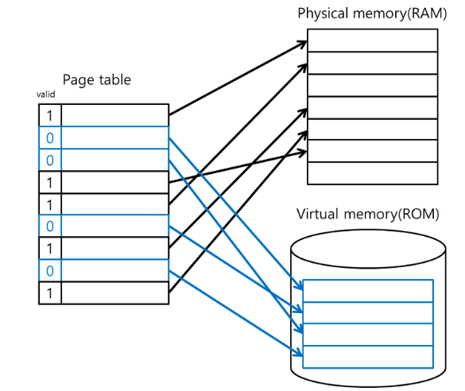
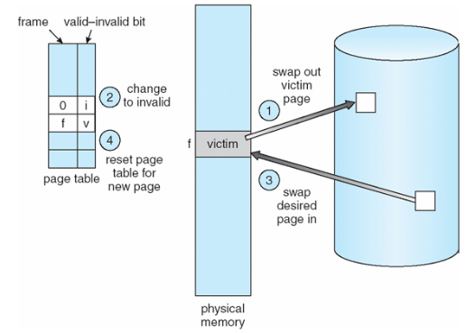

# 가상 메모리

## 메모리란?
메모리란 프로그램과 프로그램 수행에 필요한 데이터 및 코드를 저장하는 장치입니다.
메모리는 크게 **내부 기억장치**인 주기억장치와 **외부 기억장치**인 보조 기억장치로 분류됩니다.
- 주기억장치 : 레지스터, 캐쉬
- 보조 기억장치 : SSD, HDD

## 가상 메모리 등장 배경
초기 컴퓨터에서는 사용 가능한 RAM의 용량이 가장 큰 실행 어플리케이션의 주소 공간보다 커야했습니다.

그렇지 않을 경우 "메모리 부족"으로 해당 어플리케이션을 실행할 수 없었습니다.

이후 컴퓨터에서는 프로그래머가 애플리케이션의 일부분만 기억장치에 올려 실행하도록 지정할 수 있게 하는 **오버레이 기법**을 사용했으나 전반적인 메모리 부족 문제를 해결하지 못했습니다.

그래서 등장한 개념이 **가상 메모리 기법**입니다.

애플리케이션을 실행하는데 얼마나 많은 메모리가 필요한지에 집중하지 않고, 대신 애플이케이션이 실행하는데 최소한 얼마만큼의 메모리가 필요한가에 집중하여 문제를 해결한 것 입니다.

## 가상 메모리란?

가상 메모리는 **프로세스 전체가 메모리 내에 올라오지 않더라도 실행이 가능하도록 하는 기법**입니다. 프로그램이 물리 메모리보다 커도 된다는 주요 장점이 있습니다.

애플리케이션이 실행될 때, 실행에 필요한 일부분만 메모리에 올라가며 애플리케이션의 나머지는 디스크에 남게 됩니다. 즉, 디스크가 RAM의 보조 기억장치처럼 동작하는 것을 의미합니다. (빠르고 작은 기억장치(RAM)을 크고 느린 기억장치(디스크)와 병합하여, 하나의 크고 빠른 기억장치(가상 메모리)처럼 동착하게 하는 것)

가상 메모리를 구현하기 위해서는 컴퓨터가 특수 메모리 관리 하드웨어를 가지고 있어야 합니다.
=> 바로 MMU(Memory Management Unit)

> MMU란?
> - MMU는 가상주소를 물리주소로 변환하고, 메모리를 보호하는 기능을 합니다.
> - MMU를 사용하게 되면, CPU가 각 메모리에 접근하기 이전에 메모리 주소 변역 작업을 수행합니다.
> - 그러나 메모리를 일일이 가상 주소에서 물리적 주소로 번역하게 되면 작업부하가 너무 높아지므로, MMU는 RAM을 여러 부분으로 나누어 각 페이지를 하나의 독립된 항목으로 처리합니다.
> - 페이지 및 주소 번역 정보를 기억하는 작업이 가상 메모리를 구현하는데 있어 큰 역할을 합니다.

### 가상 메모리의 장점
- 프로그램은 물리 메모리 크기에 의해 제약받지 않아도 됩니다.
- 더 많은 프로그램을 동시에 실행할 수 있게 됩니다.
- 프로그램을 메모리에 올리고 스왑하는데 필요한 입/출력 횟수가 줄어듭니다. => 실행 시간 향상

### 요구 페이징(demand paging)
요구 페이징이란 CPU가 요청할 때 프로세스의 데이터를 메모리에 올리는 것을 의미합니다. 즉, 처음부터 모든 데이터를 메모리로 적재하지 않습니다.

### 페이지 교체
`요구 페이징`에서 말했 듯이 프로그램 실행시에 모든 항목이 물리 메모리에 올라오지 않기 때문에, 프로세스의 동작에 필요한 페이지를 요청하는 과정에서 page fault(페이지 부재)가 발생하게 되면, 원하는 페이지를 보조저장장치에서 가져오게 됩니다. 하지만 만약 물리 메모리가 모두 사용중인 상황이라면, 페이지 교체가 이뤄져야 합니다.

[ 순서 ]

1. 디스크에서 필요한 페이지의 위치를 찾는다.
2. 빈 페이지 프레임을 찾는다.
    - `페이지 교체 알고리즘`을 통해 희생될 페이지를 고른다.
    - 희생될 페이지를 디스크에 기록하고, 관련 페이지 테이블을 수정한다.
3. 새롭게 비워진 페이지 테이블 내 프레임에 새 페이지를 읽어오고, 프레임 테이블을 수정한다.
4. 사용사 프로세스 재시작

### 페이지 부재
**프로세스가 메인 메모리에 저장되지 않은 페이지를 사용**하려 할 때 발생합니다. 즉, 프로세스가 사용하려고 하는 **페이지가 메인 메모리에 없는** 경우를 말합니다.

프로세스가 동작하면서 실제 메모리에 필요한 데이터가 없으면, 즉 페이지 폴트가 발생하면 **해당 페이지를 가상 메모리에서 찾게됩니다.** 가상메모리는 하드디스크에 저장되어 있기 때문에, 페이지 폴트가 발생하면 I/O에 의한 속도의 저하가 발생합니다.

페이지 폴트가 자주 발생할수록 성능이 저하되기 때문에 페이지 폴트가 발생하지 않게 하는 것이 중요합니다. 이를 최소화 하기 위해 `페이지 교체 알고리즘` 등장하였습니다.

### 페이지 교체 알고리즘
- FIFO
  - 메모리에 올라온지 가장 오래된 페이지를 교체합니다.
- 최적 페이지 교체
  - 앞으로 가장 오랫동안 사용되지 않을 페이지를 교체합니다.
- LRU
  - 최근에 가장 오랫동안 사용하지 않은 페이지를 교체합니다.
- LFU
  - 참조 횟수가 가장 적은 페이지를 교체합니다.

### TLB(Translation Lookaside Buffer, 페이지 정보 캐쉬)
TLB는 가상 메모리 주소를 물리적 주소로 **변환하는 속도를 높이기 위한 캐쉬**로, 최근에 일어난 가상메모리와 물리 주소를 변환 테이블에 저장합니다. CPU에 가상 주소를 가지고 메모리를 접근하려고 할 때 우선 TLB를 접근하여 가상 주소에 해당되는 물리 주소를 찾고, 만약 TLB에 매핑이 존재하지 않는다면 MMU가 페이지 테이블에서 해당되는 물리 주소를 변환한 후 메모리에 접근하게 됩니다.
