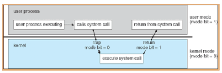
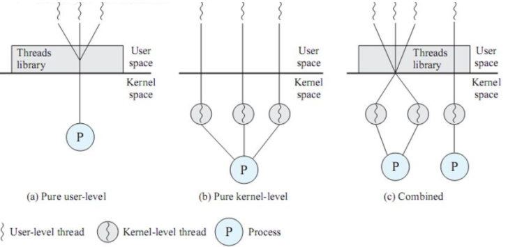
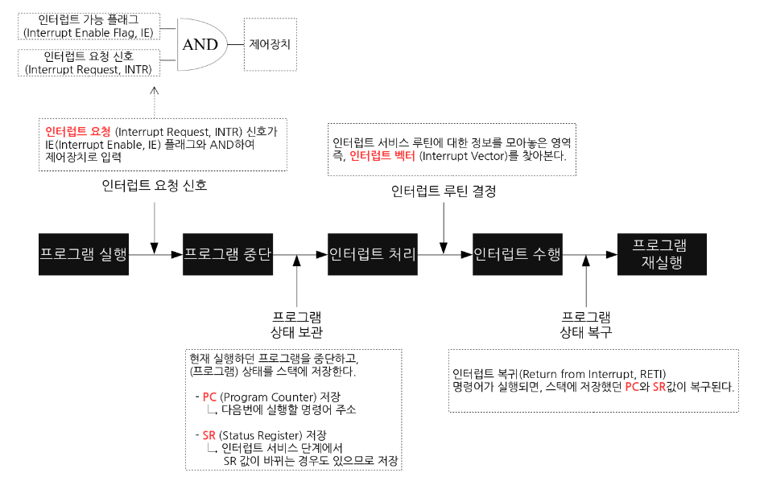

# Kernel

## 커널이란?
커널은 운영체제 중 항상 메모리에 올라가 있는 **운영체제의 핵심 부분**으로써 하드웨어와 응용 프로그램 사이에서 **인터페이스를 제공하는 역할**을 하며 **컴퓨터 자원들을 관리하는 역할**을 합니다.

즉, 커널은 인터페이스로써 응용 프로그램 수행에 필요한 여러가지 서비스를 제공하고, 여러가지 하드웨어(CPU, 메모리) 등의 리소스를 관리하는 역할을 합니다.

## 커널의 자원 관리

커널의 가장 큰 목표는 **컴퓨터의 물리적(하드웨어) 자원**과 **추상화 자원**을 관리하는 것입니다.

추상화란 물리적으로 하나뿐인 하드웨어를 여러 사용자들이 번갈아 사용할 수 있도록 마치 여러개처럼 보이게 하는 기술입니다.

- 프로세스 관리
  - 어느 프로세스가 CPU를 언제 얼마나 오랫동안 사용할지를 결정합니다.
  - 시분할 시스템을 실현해줍니다.
- 메모리 관리
  - 메모리가 어디에서 무엇을 저장하는데 얼마나 사용되는지를 추척하고, 프로세스가 이용하는 독립적인 공간을 확보합니다.
  - 메모리를 효율적으로 사용할지도 관리합니다.
- 장치 드라이버
  - 컴퓨터에 연결된 장치들을 드라이버라는 매개체를 통해 제어합니다.
  - 어플리케이션 단에서는 추상적으로 제어할 수 있도록 해줍니다.
- 시스템 콜 인터페이스 어플리케이션
  - 시스템으로 어떤 명령을 주고 싶으면 시스템 콜을 합니다. 이 시스템 콜이 인터페이스를 통해 전달합니다.(like 접수 창구)
  - 디스크 엑세스, 네트워크 관련 요청들이 모두 시스템 콜에 포함됩니다.

## 커널 모드 & 유저 모드
커널에서 중요한 자원을 관리하기 때문에, 사용자가 그 중요한 자원에 접근하지 못하도록 모드를 2가지로 나눠 관리합니다.

- 유저 모드
  - 유저가 접근할 수 있는 영역으로 제한적으로 두고, 프로그램의 자원에 함부로 침범하지 못하는 모드 입니다.
  - 우리는 여기서 코드를 작성하고, 프로세스를 실행하는 등의 행동을 합니다.
  - 시스템 서비스를 호출하면 커널 모드로 전환합니다.
- 커널 모드
  - 프로그램이 수행되다가 인터럽트에 걸려 운영체제가 호출되어 수행되는 모드입니다.
  - 모든 자원(드라이버, 메모리, CPU 등)에 접근, 명령을 할 수 있습니다.
  - 운영체제 코드나 디바이스 드라이버 같은 커널 모드 코드를 실행합니다.

## 커널 레벨 쓰레드 & 유저 레벨 쓰레드

### 스레드 종류

1. Pure user-level
- 커널 스레드 1개당 사용자 스레드 N개를 의미 합니다.(1 : N)
- 사용자 스레드에서 I/O 발생하면 완료될 때까지 프로세스는 Block됩니다.

2. Pure Kernel-level
- 커널 내에 있는 스레드
- N개의 커널 스레드가 N개의 사용자 스레드를 당담합니다.(N : N)
- 병렬성이 좋으나 효율성이 떨어진다.

3. Combined
- 커널 스레드와 사용자 스레드를 혼합하여 사용하는 방식입니다.
- 위 두가지 방식의 혼합 버전

### 커널 레벨 스레드
- 커널 스레드는 **가장 가벼운 커널 스케줄링 단위**입니다.
- 하나의 프로세스는 적어도 하나의 커널 스레드를 가집니다.
- 커널 영역에서 스레드 연산을 수행합니다.
- 커널이 스레드를 관리하기 때문에 **커널에 종속적**입니다.
- 프로그래머 요청에 따라 스레드를 생성하고 **스케줄링하는 주체가 커널**이면 커널 레벨 스레드라고 합니다.

### 커널 레벨 스레드 장점
- 커널이 각 스레드를 개별적으로 관리합니다.
- 스레드를 몇몇 프로세서로 한번에 보낼 수 있습니다. -> 멀티 프로세서 환경에서 매우 빠릅니다.
- 다른 스레드가 입출력 작업이 다 끝날 때까지 다른 스레드를 사용해 다른 작업을 진행합니다.

### 커널 레벨 스레드 단점
- 스케줄링과 동기화를 위해 **커널을 호출하는데 무겁고 오래걸립니다.**
- 사용자 모드 <-> 커널 모드 전환이 빈번하게 일어나 **성능 저하**가 발생합니다.
- 구현이 어렵고 자원을 더 많이 소비합니다.

### 사용자 레벨 스레드
- 사용자 영역에서 스레드 연산을 수행합니다.
- 커널에 의존적이지 않은 형태로 스레드의 기능을 제공하는 **라이브러리를 활용**하는 방식입니다.

### 사용자 레벨 스레드 장점
- 운영체제에서 스레드를 지원할 필요가 없습니다.
- 스케줄링 결정이나 동기화를 위해 커널을 호출하지 않기 때문에 **인터럽트가 발생할 때 커널 스레드보다 오버헤드가 적습니다.**
- 즉, 사용자 영역 스레드에서 행동을 하기 때문에 **OS 스케줄링의 Context Switch이 없습니다.**
- 커널은 사용자 레벨 스레드를 모르기 때문에 모드 전환이 발생하지 않아 성능이 좋아집니다.

### 사용자 레벨 스레드 단점
- 스케줄링 우선순위를 지원하지 않습니다.
  - 어떤 스레드가 먼저 동작할지 예측이 어렵습니다.
- 프로세스에 속한 스레드 중 I/O 작업 등에 의해 하나라도 block이 걸린다면 전체 스레드가 block됩니다.

## 인터럽트란?
CPU가 프로그램을 실행하고 있을 때, I/O장치나 예외가 발생하여 처리가 필요한 경우 마이크로프로세서에게 알려 일을 처리할 수 있도록 하는 것

### 인터럽트를 하는 이유?
입출력 연산이 CPU 명형 수행 속도보다 현저히 느리기 때문입니다.

### 인터럽트 종류
- 하드웨어 인터럽트
  - 하드웨어가 발생시키는 인터럽트로 CPU가 아닌 다른 하드웨어 장치가 CPU에 어떤 사실을 알려주거나 CPU 서비스를 요청해야 할 경우 발생
  - EX) 정전 또는 전원 공급의 이상, CPU 또는 기타 하드웨어 오류, 타이머 인터럽트, 하드웨어 입춥력 장치
- 소프트웨어 인터럽트
  - 소프트웨어가 발생시키는 인터럽트입니다. 소프트웨어가 스스로 인터럽트 라인을 세팅합니다.
  - EX) 허가되지 않은 메모리 주소 참조, 0으로 나누는 경우, 시스템 콜, 페이지 부재

### 인터럽트 과정

1. 프로그램 실행
2. 인터럽트 요청
3. 프로그램 중단
   - 수행중이던 상태를 PCB에 저장
   - PC에 다음에 실행할 명령 주소 저장
4. 인터럽트 처리
  - 인터럽트 벡터를 읽고 ISR 주소를 얻어 ISR로 점프
  - 해당 코드 처리
5. PC값을 복원하여 이전 실행 위치로 복원
6. 수행중이던 프로그램 재실행

### 인터럽트 우선순위
여러장치에서 인터럽트가 동시에 발생하거나, 인터럽트 서비스 루틴 수행중 인터럽트가 발생한다면 우선순위를 따져서 처리합니다.

**[ 우선 순위 ]**
- 전원 이상 > 기계 착오 > 외부 신호 > 입출력 > 명령어 잘못 > 프로그램 검사 > SVC
- 일반적으로 하드웨어 인터럽트가 소프트웨어 인터럽트보다 우선순위가 높다.
- 외부 인터럽트가 내부 인터럽트보다 우선 순위가 높다.

## 시스템 콜
커널 영역의 기능을 사용자 모드가 사용 가능하게, 즉, 프로세스가 하드웨어에 직접 접근해서 필요한 기능을 할 수 있게 해준다.

### 시스템 콜 종류

- 프로세스 제어 (Process Control)
    - 끝내기(exit), 중지 (abort)
    - 적재(load), 실행(execute)
    - 프로세스 생성(create process) - fork 
    - 프로세스 속성 획득과 속성 설정 
    - 시간 대기 (wait time)
    - 사건 대기 (wait event)
    - 사건을 알림 (signal event)
    - 메모리 할당 및 해제
- 파일 조작 (File Manipulation)
    - 파일 생성 / 삭제 (create, delete)
    - 열기 / 닫기 / 읽기 / 쓰기 (open, close, read, wirte)
    - 위치 변경 (reposition)
    - 파일 속성 획득 및 설정 (get file attribute, set file attribute)
- 장치 관리 (Device Manipulation)
    - 하드웨어의 제어와 상태 정보를 얻음 (ioctl)
    - 장치를 요구(request device), 장치를 방출 (relese device)
    - 읽기 (read), 쓰기(write), 위치 변경 
    - 장치 속성 획득 및 설정 
    - 장치의 논리적 부착 및 분리
- 정보 유지 (Information Maintenance)
    - getpid(), alarm(), sleep()
    - 시간과 날짜의 설정과 획득 (time)
    - 시스템 데이터의 설정과 획득 (date)
    - 프로세스 파일, 장치 속성의 획득 및 설정
- 통신 (Communication)
    - pipe(), shm_open(), mmap()
    - 통신 연결의 생성, 제거 
    - 메시지의 송신, 수신 
    - 상태 정보 전달 
    - 원격 장치의 부착 및 분리
- 보호 (Protection)
    - chmod()
    - umask()
    - chown()

### 자바의 시스템 콜
`JVM -> JNI -> 시스템 콜 -> 커널 -> 디스크 컨트롤러 -> 커널 버퍼 복사 -> JVM 버퍼 복사`

> JNI(Java Navtive Interface)는 C 혹은 C++로 작석된 모듈에 접근하게 해주는 인터페이스다. JAVA는 C와 C++로 만들어진 언어라서 코드를 보다 보면 native 예약어가 붙어 있는 것들을 볼 수 있다. 이것들이 C 혹은 C++로 작성된 모듈과 연결이 된다.
> 
