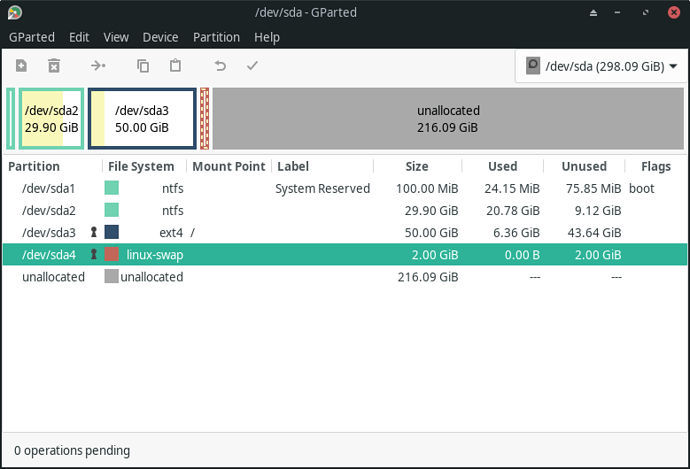
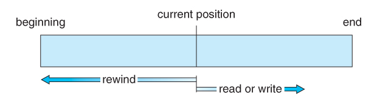
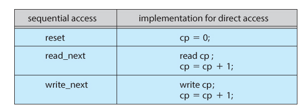
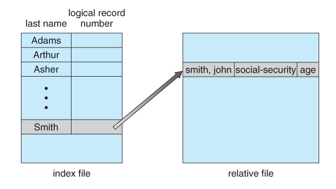

# 파일 시스템

## 파일 시스템이란?
컴퓨터에서 파일이나 자료를 쉽게 발견할 수 있도록 유지, 관리하는 방법이다.

저장매체에는 많은 파일이 있으므로 이러한 **파일을 관리하는 방법**을 말한다.

## 파일 시스템의 특징
- 커널 영역에서 동작한다.
- 파일을 빠르게 읽기, 쓰기, 삭제 등 기본적인 기능을 원활히 수행하기 위한 목적을 가진다.
- 계층적 디렉토리 구조를 가진다.
- 디스크 파티션 별로 하나씩 둘 수 있다.

> 디스크 파이션?
> 하드 디스크 드라이브의 기억 공간을 "파티션"이라 알려진 별도의 데이터 영역으로 분할하는 것을 말한다.
>  

## 파일 시스템의 역할
- 파일 관리: 파일 저장, 참조, 공유
- 보조 저장소 관리 : 저장 공간 할당
- 파일 무결성 메커니즘 : 시스템 파일과 디렉터리의 컨텐츠 보호와 더불어 파일 시스템 권한 보호. 파일이 의도한 정보만 포함하고 있다는 것을 의미한다.
- 접근 방법 : 저장된 데이터에 접근할 수 있는 방법 제공

## 파일 시스템의 개발 목적
- HDD와 메인 메모리 속도 차 줄이기
- 파일 관리 용이
- HDD의 막대한 용량을 효율적으로 이용

## 파일 시스템 종류
- Windows : FAT(FAT12/16/32,exFAT), NTFS
- Linux : ext(ext2/3/4)
- Mac OS : HFS, HFS+
- Google : GFS
*GFS : Google File System으로 구글에서 사용하는 분산 파일 시스템

## 파일 접근 방법
파일들은 정보를 저장한다. 파일이 사용될 때, 이 정보는 반드시 접근되어서 컴퓨터 메모리에 적재되어야 한다. 파일 내의 정보에 접근하는 몇몇의 방법이 있는데, 어떤 시스템은 오직 파일 접근 방법이 한 가지 밖에 없다. 바년에 IBM mainframe 운영체제와 같은 다른 시스템들은 수 많은 접근 방법들을 제공한다.

### 순차접근(Sequential Access)
- 가장 간단한 접근 방법
- 파일 내의 정보들이 순서대로 처리되는데, 저장되어 있는 레코드 순서대로 접근한다.
- 이 접근 모드가 가장 일반적이며, 편집기나 컴파일러는 보통 이러한 방식으로 파일에 접근한다.
- 읽기와 쓰기가 파일 연산의 대부분을 차지하고 있다.
- 읽기 연산은 파일의 다음 부분부터 읽어 나가며 자동적으로 입출력 위치를 추적하는 파일 포인터를 증가시킨다.
- 쓰기 연산은 파일의 끝 부분에 내용을 추가하며 새로운 파일의 끝으로 파일 포인터가 이동한다. 오프셋을 시작점이나 마지막 점으로 이동시킬 수 있고, N 정수만큼 건너뛸 수도 있다.
- 순사 접근은 테이프 모델에 기반하며 임의 접근 장치는 순차 접근이 가능하다.
- 정리하면 배열과 같이 파일을 읽는다.

### 직접 접근(Direct Access)
- 파일은 프로그램이 특정한 순서 없이 빠르게 읽고 쓸 수 있도록 하는 고정된 길이의 논리 레코드 집합으로 정의된다.
- 직접 접근 방법은 파일의 디스크 모델에 기초하고 있는데, 디스크가 임의 파일 블록에 임의적 접근하는 것을 허용하기 때문이다.
- 직접 접근 측면에서, 파일은 번호를 갖는 일련의 블록 또는 레코드로 간주된다. 그래서 우리는 블록 14를 읽은 후에 블록 53을 읽으며, 블록 7에 작성할 수 있는 것이다. 직접 접근 파일에 읽기 또는 쓰기 순서에 제약이 없다.
- 직접 접근 파일은 대용량 정보에 즉각적인 접근에 용이하다. 이를 테면, 데이터베이스가 이러한 유형에 속하는데, 특정 내용에 관한 쿼리가 도착하면, 어느 블록이 관련 내용물을 포함하고 있는지 계산하고 그 블록을 직접적으로 읽어들여 관련 정보를 제공한다.
- 정리하면 현재 위치를 가리키는 CP변수를 가지고 어느 블록이든 접근할 수 있다.

### 기타 접근(Other Access Methods)
- 다른 접근 방법들은 직접 접근 방법을 기반으로 한다. 이 방법은 일반적으로 파일의 색인(index)을 사용한다.
- 크기가 큰 파일을 입출력 탐색할 수 있게 도와준다.
- 해시테이블과 같이 파일을 읽는다.

## 파일 시스템 구조

- 메타 영역(파일 데이터의 데이터가 저장된 영역)과 데이터 영역(실제 데이터가 기록된 영역) 두가지 영역으로 구분이 된다.
- 메타 영역 : 데이터 영역에 기록된 파일의 이름, 위치, 크기, 시간정보, 삭제유무 등 파일의 정보
- 데이터 영역 : 파일의 데이터
* 윈도우 탐색기를 이용하여 검색할때 메타 영역을 탐색하면서 파일을 찾는다.
