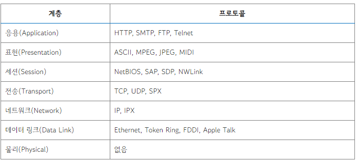
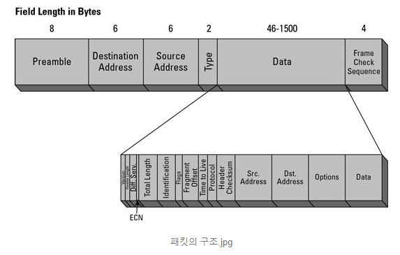
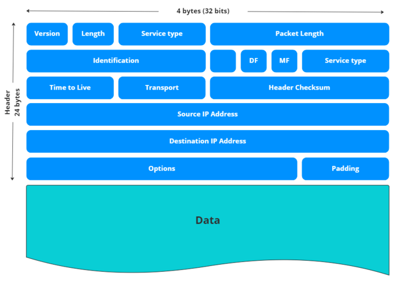
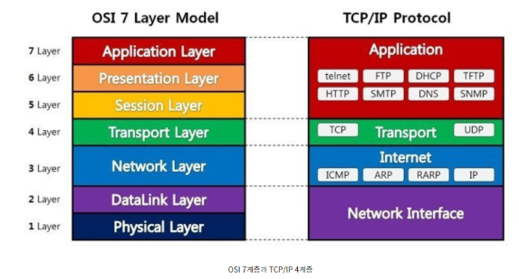
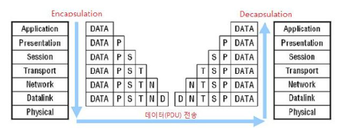
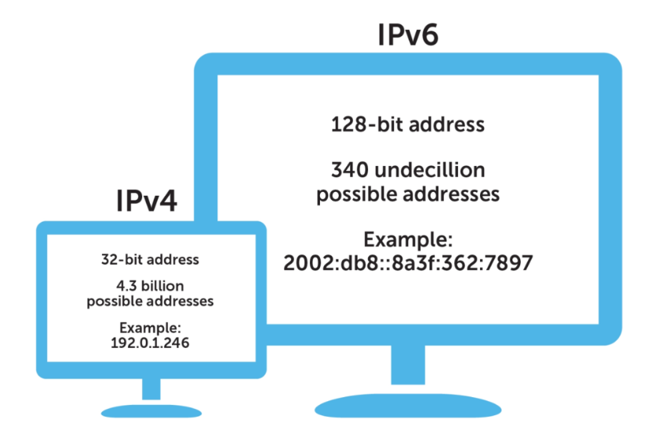
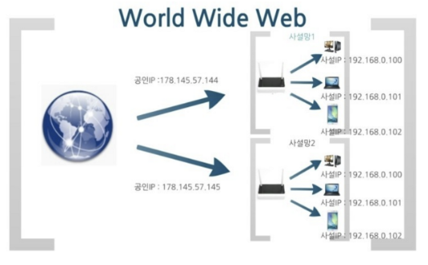

# 프로토콜

## 프로토콜이란?
서로 다른 기기들 간의 데이터 교환을 위해 표준화한 통신 규약입니다.

### 프로토콜의 종류

### 프로토콜의 기능
- 단편화 : 효율적인 데이터 전송을 위해 일정한 크기의 데이터 블록으로 나누는 것
- 재조립 : 단편화한 것을 복원하는 과정
- 캡슐화 : 상위 계층의 데이터에 각종 제어정보(헤더, 트레일러 등)를 **추가**하여 하위 계층으로 보내는 과정
- 연결 제어 : 통신 개체간의 연결을 제어한다.(연결 설정, 데이터 전송, 연결 해제)
- 흐름 제어 : 수신측에서 송신측이 송신하는 데이터의 전송량이나 전송 속도를 조절하는 기능. 정지 대기 방식과 슬라이딩 윈도우 방식을 사용한다.
- 오류 제어 : 데이터 전송 중 발생할 수 있는 오류나 착오 등을 검출하고 정정하는 기능
- 동기화 : 두 개의 통신 개체가 동시에 같은 상태를 유지하도록 하는 것
- 주소 지정 : 송수신자의 주소를 부여함으로써 데이터의 정확한 전송을 보장한다.
- 다중화 : 하나의 통신회선을 여러 통신 개체들이 동시에 접속할 수 있는 기술

## 패킷이란?
컴퓨터 간에 데이터를 주고 받을 때 네트워크를 통해서 전송되는 데이터 조각

### 패킷의 구조

- 헤더
  - 버전 : 사용중인 IP 버전(IPv4, IPv6)
  - TTL(Time to Live) : 이 패킷이 네트워크에 남아있을 수 있는 시간이다. 이 패킷을 처리하는 각 라우터는 이 카운터를 하나 이상 감소시킨다.
  - 프로토콜 : IP 패킷의 데이터 부분이 전달되는 전송 계층 프로토콜(TCP or UDP)
  - 헤더 체크섬 : 헤더가 전송되는 도중 변조되거나 깨지는 경우를 확인하기 위한 헤더
  - 소스 주소 : 패킷을 네트워크로 보내는 장치의 IP주소
  - 대상 주소 : 패킷이 전송되는 IP주소
- 페이로드 : 패킷에 의해 전송되는 실제 데이터를 나타낸 것으로 데이터라고도 부른다. 페이로드는 헤더 정보가 목적지에 도달할 때 패킷에서 제거되므로 소스 및 목적지에서 수신하는 유일한 데이터
- 트레일러 : 패킷 트레일러의 내용은 각 네트워크 유형에 따라 다르며 일반적으로 트레일러에는 수신 장치에 패킷 끝까지 도달했음을 알리는 비트와 컴퓨터가 모든 패킷이 완전히 수신되었는지 확인할 수 있는 CRC가 포함된다.

## OSI 7 Layer & TCP/IP Layer

## OSI 7 Layer

- 물리 계층
  - 데이터를 전기적인 신호로 변환해서 주고 받는 기능을 제공하는 공간
  - 전송 단위 : 비트
  - 장비 : 리피터, 케이블, 허브 등
- 데이터 링크 계층
  - 물리 계층으로 송수신되는 정보를 관리하여 안전하게 전달되도록 도와주는 역할
  - MAC 주소를 통해 통신
  - 전송 단위 : 프레임
  - 장비 : 브릿지, 스위치 등
- 네트워크 계층
  - 데이터를 목적지까지 가장 안전하고 빠르게 전달하는 기능을 담당한다.
  - 라우터를 통해 이동할 경로를 선택하여 IP주소를 지정하고, 해당 경로에 따라 패킷을 전달해준다.
  - 라우팅, 흐름 제어, 오류 제어, 세그먼테이션 등을 수행
  - 전송 단위 : 패킷
  - 장비 : 라우터 등
- 전송 계층
  - 전체 메시지를 종단 vs 종단(End-to-End, 발신지에서 목적지)간 제어와 에러를 관리한다.
  - 패킷의 전송이 유효한지 확인하고 전송에 실패된 패킷을 다시 보내는 것과 같은 신뢰성있는 통신을 보장
  - 주소 설정, 오류 및 흐름 제어, 다중화를 수행
  - 전송 단위 : 세그먼트
  - 장비 : 게이트웨이, L4 스위치 등
- 세션 계층
  - 데이터가 통신하기 위한 논리적 연결을 담당
  - TCP/IP 세션을 만들고 없애는 책임을 지니고 있다.
  - 포트 번호를 기반으로 연결한다.
  - API, Socket
- 표현 계층
  - 데이터 표현에 대한 독립성을 제공하고 암호화하는 역할을 담당한다.
  - 파일 인코딩, 명령어를 포장, 압축, 암호화한다.
  - JPEG, MPEG 등
- 응용 계층
  - 최종 목적지로, 응용 프로세스와 직접 관계하여 일반적인 응용 서비스르 수행한다.
  - 사용자 인터페이스, 전자우편, 데이터베이스 관리 등의 서비스를 제공
  - HTTP, FTP, DNS 등

## TCP/IP Layer
OSI 7 Layer를 기반하여 실무적으로 이용될 수 있도록 단순화된 모형

- TCP : 전송 제어 프로토콜로 전송 계층에 위치하며 네트워크 정보 전달을 통제하는 핵심 프로토콜
- IP : 패킷 교환 네트워크에서 정보를 주고받는데 사용하는 정보 위주의 규약이며 네트워크 계층에서 호스트의 주소지정과 패킷 분할 및 조립 기능을 담당

- 네트워크 계층(Network Layer)
  - MAC 주소를 참조해 장비 간 데이터 송수신
  - 브리지, 스위치
- 인터넷 계층(Internet Layer)
  - 데이터 전송을 위한 IP 주소 지정 및 경로 지정
  - 라우터
- 전송 계층(Transport Layer)
  - Port 번호로 호스트 간의 연결 제어 및 자료 송수신
  - 게이트 웨이
- 응용 계층(Application Layer)
  - 응용프로그램 간의 데이터 송수신
  - 사용자 응용 프로그램 인터페이스

## HTTP 통신 과정
1. 송신측 클라이언트의 애플리케이션 계층(HTTP)에서 웹 페이지 요청인 HTTP Request를 보냅니다.
2. 트랜스포트 계층은 애플리케이션 계층에서 받은 데이터를 조각내어 안내 번호와 포트 번호를 붙여 네트워크 계층으로 전달합니다.
3. 네트워크 계층(IP)에서는 수신지 MAC 주소를 추가해서 링크 계층에 전달합니다.
4. 이제 수신 측 링크 계층에서 데이터를 받아들여 순서대로 위의 계층에 전달하여 애플리케이션 계층까지 전달합니다.

- 애플리케이션 계층에서 하위 계층으로 가면서 해당 계층의 정보를 헤더에 추가하는 과정을 캡슐화라고 합니다.
- 하위 계층에서 애플리케이션 계층으로 가면서 헤더의 정보를 제거하는 과정을 역캡슐화라고 합니다.

## IP란
패킷 교환 네트워크에서 정보를 주고받는데 사용하는 정보 위주의 규약이며 네트워크 계층에서 호스트의 주소지정과 패킷 분할 및 조립 기능을 담당

## IP 주소란?
IP 주소는 인터넷에 연결된 각 기기를 구별하기 위해 사용되는 고유한 번호이다.

IP는 프로토콜 그 자체이고 IP주소는 IP통신을 하기 위해 각 기기들을 구분하는 고유번호라고 이해하면 된다.

IPv4: 32비트로 구성된 IP 주소로, 대략 43억 개의 고유한 주소를 생성할 수 있다. IPv4 주소는 4개의 0~255 사이의 숫자로 이루어져 있으며, 각 숫자는 점(.)으로 구분된다. 
예) 192.168.0.1

IPv6: 128비트로 구성된 IP 주소로, 거의 무한한 수의 고유한 주소를 생성할 수 있다. IPv6 주소는 8개의 4자리 16진수로 이루어져 있으며, 각 16진수는 콜론(:)으로 구분된다. 
예) 2001:0db8:85a3:0000:0000:8a2e:0370:7334

## IP 주소의 규칙

IP 주소는 네트워크에서 스마트폰이나 PC 등, 각각의 디바이스를 구별하는 정보이다.

IP주소는 **네트워크 주소**와 **호스트 주소**로 구성되어 있다.

네트워크 주소 : IP주소가 속한 네트워크
호스트 주소 : 네트워크 안에서 Host를 구별하는 번호

IP주소만 보고는 어디까지가 네트워크 주소이고 호스트 주소인지 알 수 없다. 그래서 IP주소는 Class라는 일정한 규칙을 가지고 있다.

- A Class : 001.xxx.xxx.xxx ~ 127.xxx.xxx.xxx = 0/0000000(2).xxx.xxx.xxx ~ 0/1111111(2).xxx.xxx.xxx
- B Class : 128.xxx.xxx.xxx ~ 191.xxx.xxx.xxx = 10/000000(2).xxx.xxx.xxx ~ 10/111111(2).xxx.xxx.xxx
- C Class : 192.xxx.xxx.xxx ~ 223.xxx.xxx.xxx = 110/00000(2).xxx.xxx.xxx ~ 110/11111(2).xxx.xxx.xxx
- D Class : 224.xxx.xxx.xxx ~ 239.xxx.xxx.xxx = 1110/0000(2).xxx.xxx.xxx ~ 1110/1111(2).xxx.xxx.xxx
- E Class : 240.xxx.xxx.xxx ~ 255.xxx.xxx.xxx = 1111/0000(2).xxx.xxx.xxx ~ 1111/1111(2).xxx.xxx.xxx

이 규칙에 따라 A Class는 첫 3자리, B Class는 6자리까지, C Class는 세 번째 9자리까지 Network 주소이다.

10.20.30.40이라는 IP 주소가 있다면 10.xxx.xxx.xxx는 A Class이므로 10.0.0.0이 Network 주소이며 0.20.30.40은 Host 주소이다.
130.140.150.160이라는 IP주소가 있다면 130.xxx.xxx.xxx는 B Class이므로 130.140.0.0이 Network 주소이며 0.0.150.160은 Host 주소이다.

## IP 주소 종류

### 고정 IP 주소
고정IP는 말 그대로 변하지 않고 컴퓨터에 고정적으로 부여된 IP이다.

한번 부여되면 IP 반납을 하기 전까지는 다른 장비에 부여할 수 없는 고유의 IP로

보안성이 우수하기 때문에 보안이 필요한 업체나 기관에서 사용한다. 

### 유동 IP 주소(동적IP)

역시 말그대로 변하는 IP이다.

인터넷 사용자 모두에게 고정 IP를 부여해 주기는 힘들기 때문에,

일정한 주기 또는 사용자들이 인터넷에 접속하는 매 순간마다 사용하고 있지 않은 IP 주소를 임시로 발급해 주는 IP이다.

대부분의 사용자는 유동 IP를 사용한다.

### 공인 IP 주소

공인 IP는 외부에 공개되어 있는 IP주소 입니다. SKT와 같은 통신사에서는 인터넷을 연결하면 주는 공유기의 IP가 공인 IP에 해당합니다.

### 사설 IP 주소
공인 IP를 사용하는 공유기를 통해 컴퓨터, 핸드폰과 같은 네트워크 기기는 사설 IP를 할당 받습니다.

공인 IP는 전 세계에서 유일하지만, 사설 IP는 하나의 네트워크 안에서 유일하다.

공인 IP는 외부, 내부 상관없이 해당 IP에 접속할 수 있으나, 사설 IP는 내부에서만 접근이 가능하다.
