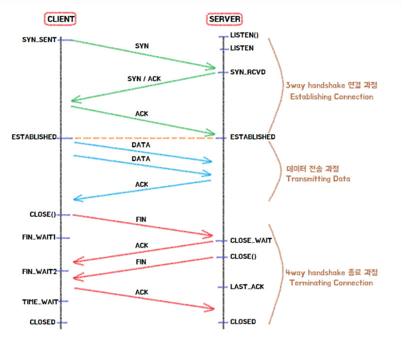
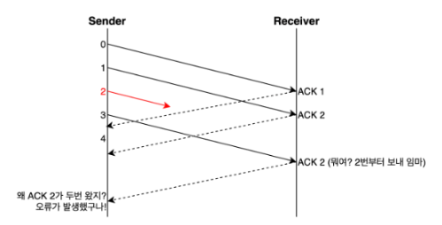

# TCP와 UDP

## TCP 특징
- 연결 지향 방식으로 가상 회선 방식을 사용한다.
- 3-way handshaking과정을 통해 연결을 설정하고 4-way handshaking을 통해 해제한다.
- 흐름 제어 및 혼잡 제어를 수행한다.
  - 흐름 제어 : 데이터 처리 속도를 조절하여 수신자의 버퍼 오버플로우를 방지
  - 혼잡 제어 : 네트워크 내의 패킷 수가 과도하게 증가하지 않도록 방지
- 높은 신뢰성을 보장한다. 
  - UDP에 비해 속도가 느리다.
- 전이중, 점대점 방식이다.
  - 전이중(Full-Duplex) : 전송이 양방향으로 동시에 일어날 수 있다.
  - 점대점(Point to Point) : 각 연결이 정확히 2개의 종단점을 가지고 있다.

> 가상 회선 방식
> - 패킷 전송되기 전에 패킷 헤더에 미리 경로를 설정
> - 설정된 경로만을 따라 데이터를 전송
> 
> 

## UDP 특징
- 비연결형 서비스로 데이터그램 방식을 제공한다.
  - 데이터의 전송 순서가 바뀔 수 있다.
- 데이터 수신 여부를 확인하지 않는다.
- 신뢰성이 낮다.
  - 흐름 제어가 없어서 제대로 전송되었는지, 오류가 없는지 확인할 수 없다.
- TCP에 비해 속도가 빠르다.
- 1:1 & 1:N & N:N 통신이 가능하다.

> 데이터그램 방식
> - 패킷마다 최적의 경로를 선택
> 
> 

## 3-way handshaking

> Flag 종류
> - SYN
>   - 접속요청을 할 때 보내는 패킷
>   - TCP 접속시에 가장 먼저 보내는 패킷
> - ACK
>   - 상대방으로부터 패킷을 받은 뒤에, 잘 받았다고 알려주는 패킷
>   - 다른 플래그와 같이 출력되는 경우도 있다.
> - PSH
>   - 데이터를 즉시 목적지로 보내라는 의미
> - FIN
>   - 접속종료를 위한 플래그
>   - 이 패킷이 보내는 곳이 현재 접속하고 있는 곳과 접속을 끊고자 할 때 사용

## 흐름제어
송신 측과 수신 측의 데이터 처리 속도가 다를 수 있다.

송신 측이 빠를 때 수신 측 버퍼가 넘치는 **오버플로우**가 발생한다.

이러한 문제를 줄이기 위해 윈도우 크기로 **송신 측 데이터 전송량을 조절**한다.

- 윈도우 크기 : 자신이 처리할 수 있는 데이터의 양

### 흐름 제어 방법

1. Stop and Wait
   
=> **매번 전송한 패킷에 대해 확인 응답을 받아야만 그 다음 패킷을 전송하는 방법**
   
해당 방법은 단순하지만 비효율적이라 사용 안함

2. Sliding Window

해당 방법을 대부분 사용

=> **송신 측이 수신 측에서 받은 윈도우 크기를 참고해서 데이터의 흐름을 제어하는 방식**

- 수신 측이 한 번에 처리할 수 있는 데이터의 양(윈도우 크기)을 **3 way handshake**할 때 송신 측에 전달한다.
- 상대방에게 **응답을 받지 않아도 범위 내에서 데이터를 보낼 수 있다.**
- 패킷의 왕복 시간(RTT)이 크다면 **네트워크가 혼잡하다고 생각하여 윈도우 크기를 실제 버퍼 크기보다 작게 설정**한다.
- 통신 과정 중에도 네트워크 혼잡 등의 조건을 통해 **윈도우 크기는 유동적으로 설정된다.**

## 오류제어
TCP는 통신 중에 오류가 발생하면 해당 데이터를 **재전송**한다.

즉, 재전송 기반 오류 제어 ARQ(Automatic Repeat Request)를 사용한다.

재전송은 비효율적이므로 적을수록 좋다.

### 오류를 아는 방법
- 송신측이 ACK를 받지 못함
  - 송신 측이 보낸 SEQ가 유실되었거나, 수신측의 보낸 ACK이 유실된경우
- 중복된 ACK을 받는다.

- 수신측이 NACK(부정응답)을 보냄

### 오류 제어 방법

#### Stop and Wait
=> **ACK를 받고 나서 다음 데이터를 보내는 방식** 

일정 시간이 지나 timeout이 발생하면 이전 데이터를 재전송한다.

#### Go Back N
=> 연속으로 데이터를 보내다가 **오류가 발생한 지점부터 재전송하는 방식** 

아래처럼 4번 데이터에서 에러가 발생했다면 4번 이후의 데이터는 모두 삭제한다. 
**성공적으로 전송된 데이터까지 재전송하기 때문에 비효율적이다.**

#### Selective Repeat
=> **오류가 발생한 데이터만 재전송하는 방식**

**버퍼의 데이터가 순차적이지 않다는 단점이 있다.**

정렬의 과정이 필요하다.

Go Back N과 상황에 따라 더 좋은 방법을 선정해 사용

## 혼잡제어
=> 네트워크 내에 패킷의 수가 과도하게 증가하는 현상을 **혼잡**이라고 하며, 혼잡 현상을 방지하거나 제거하는 기능을 **혼잡제어**라고 한다.

- 송신 측의 데이터는 지역망이나 인터넷으로 연결된 대형 네트워크를 통해 전달된다. 만약 한 라우터에 데이터가 몰릴 경우, 자신에게 온 데이터를 모두 처리할 수 없게 된다. 이런 경우 호스트들은 또 다시 재전송을 하게되고 결국 혼잡만 가중시켜 오버플로우나 데이터 손실을 발생시키게 된다. 따라서 이러한 네트워크의 혼잡을 피하기 위해 송신측에서 보내는 데이터의 전송속도를 강제로 줄이는 기능이 있다. 이 기능을 **혼잡제어**라고한다.
- 흐름제어가 송신측과 수신측 사이의 전송속도를 다루는데 반해, 혼잡제어는 호스트와 라우터를 포함한 보다 넓은 관점에서 전송 문제를 다룬다.

## 혼잡 제어 방법

> 혼잡제어는 데이터의 전송속도를 조절하는 기능이다.
> 
> 윈도우 크기와 전송속도는 비례한다.

### AIMD(Additive Increase / Multiplicative Decrease)
- 송신 측의 windw size를 손실을 감지할 때까지 매 RTT마다 1MSS씩 증가
- 패킷 전송에 실패하거나 일정 시간을 넘으면 패킷을 보내는 속도를 절반으로 줄이는 방법
> 즉, 매 RTT를 기준으로
> 
> 정상 전송시 원도우 크기 + 1 MSS
> 
> 비정상 전송시 패킷 전송 속도 / 2 MSS

- 네트워크에 늦게 들어온 호스트가 처음에는 불리하지만, 시간이 흐르면서 평형상태로 수렴한다.
- 단점
  - 처음에 전송 속도를 올리는데 시간이 오래 걸린다.
  - 네트워크가 혼잡해지는 상황을 미리 감지하지 못한다. 즉, 네트워크가 혼잡해지고 나서야 대역폭을 줄인다.

#### Slow Start(느린 시작)
- 초기 window size : 1MSS
- 패킷이 문제 없이 도착하면 각각의 ACK패킷마다 window size를 2배씩 늘려준다.
  - 즉 매 RTT마다 window size는 2배가 됨
- 혼잡이 감지되면 윈도우 크기를 1MSS로 초기화한다.

- **임계점(Treshold)** 
  - 임계점은 여기까지만 Slow Start를 사용하겠다는 의미이다.
  - slow start threshodl(ssthresh)라고도 한다.

## TCP 혼잡 제어 정책
정책을 알아보기 전에 혼잡 상황을 알아보자

- 3 ACK Duplicated
  - 송신 측이 3번 이상 중복된 승인 번호를 받은 상황(패킷 손실)

- Timeout
  - 송신 측이 보낸 데이터 자체가 유실되었거나, 수신 측이 응답으로 보낸 ACK이 유실되는 경우

### TCP Tahoe

TCP Tahoe는 처음에는 Slow Start를 사용하다가 임계점에 도달하면 AIMD방식을 사용한다.

- 처음 Window size는 1 MSS이다.
- 임계점까지는 Slow Start를 사용한다.(window size가 2배씩 증가)
- 임계점 부터는 AIMD방식을 사용한다.(window size가 1씩 증가)
- 3 ACK Duplicate 또는 Timeout을 만나면 임계점을 window size의 절반으로 줄이고 window size를 1로 줄인다.

- **단점**
  - 3 ACK Duplicate방식을 만나고 window size가 다시 1부터 키워나가야 하므로 속도가 느리다.
  - 이를 해결하기 위해 TCP Reno가 등장한다.

### TCP Reno

TCP Reno는 TCP Tahoe와 비슷하지만 3 ACK Duplicate와 timeout 대처하는 방법이 다른다.

이유는 3 ACK Duplicate와 timeout을 비교했을 때 3ACK Duplicate는 timeout에 비해 큰 혼잡이 아니라는 가정하에 가볍게 대처하는 방식이다.

- timeout : 시간내에 패킷응답이 아예 오지 않는 것
- 3 ACK duplicate : timeout이 발생하기 이전에 중복 ACK이 3개 온다는 의미로 패킷의 전송은 잘 이루어 지고 있다는 의미

**동작 방식**
- 처음 Window size는 1 MSS이다.
- 임계점까지는 Slow Start를 사용한다.(window size가 2배씩 증가)
- 임계점 부터는 AIMD방식을 사용한다.(window size가 1씩 증가)
- 3 ACK Duplicate를 만나면 window size를 절반으로 줄이고 임계점을 그 값을 설정한다.
- Timeout을 만나면 window size를 일로 줄인다. 임계점은 변경 x
