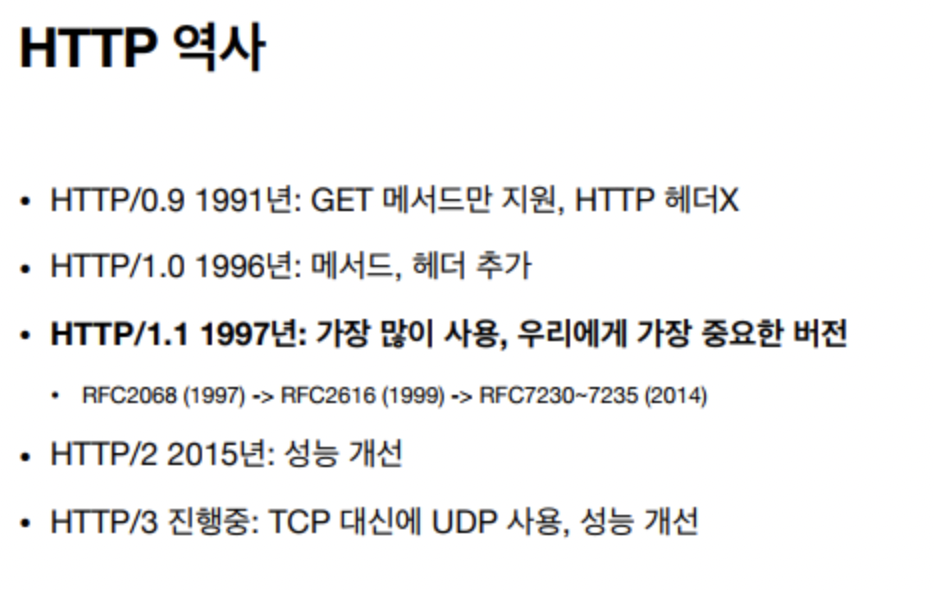
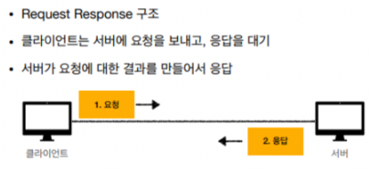
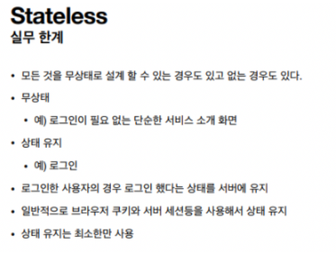
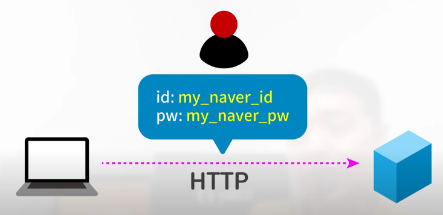
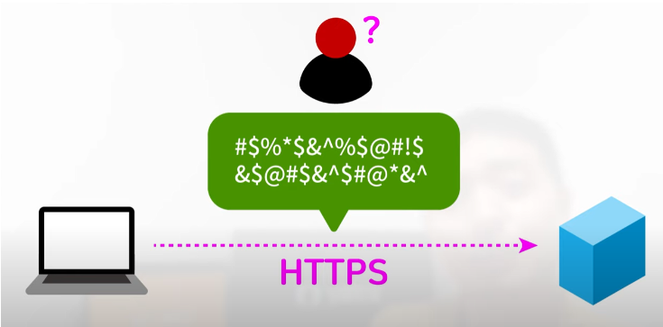
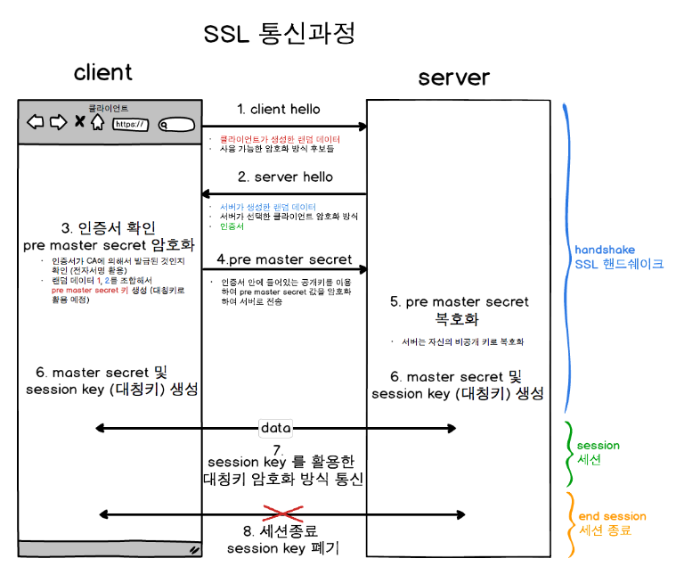
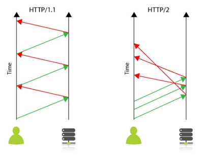

# HTTP

## HTTP란?

HyperText Transfer Protocol

⇒ 문서간에 링크를 통해 연결할 수 있는 하이퍼텍스트 문서를 통해 연결할 수 있는 HTML을 전송하는 프로토콜 ⇒ http의 시작

## HTTP의 특징
- 클라이언트 서버 구조로 동작
- 무상태 프로토콜 지향, 비연결성
- HTTP 메세지를 통해 통신
- 단순함 확장 가능

### 클라언트 서버 구조

- 비지니스 로직과 데이터들을 모두 서버에 집중시킴
- 클라이언트는 UI와 사용성 등에 집중
- 클라이언트와 서버가 각각 독립적으로 진화 가능

### Stateful & Stateless
- Stateful(상태 유지) : 중간에 요청이 다른 서버로 유입되면 안된다.
- Stateless(무상태) : 중간에 요청이 다른 서버로 유입되어도 아무런 문제가 없다.

### Stateful 통신의 문제점
만약 A서버와 계속 일련의 트랜잭션을 수행하는 도중 A서버가 다운되었을 경우 그동안 통신했던 모든 상태 값들이 날아가게 되며 클라이언트는 지금까지 진행해오던 트랜잭션을 처음부터 다시해야함

### Stateless 통신의 문제점
요청 트랜잭션을 아무 서버가 핸들링이 가능하기 때문에 무한 서버 증설이 가능하다는 장점이 있지만 상태 유지 프로토콜에 비해 서버에 보내는 데이터의 양이 늘어난다.
 

## HTTPS란?
- HTTP에 S(Secure Socket)을 추가한 것.
- 데이터를 주고 받는 과정에서 보안 요소가 추가된다.
- 클라이언트는 공개키로 데이터를 암호화해서 전송하고 서버는 개인키를 이용해 복호화 한다.
- 서버는 개인키로 데이터를 암호화해서 전송하고 공개키가 있는 클라이언트는 데이터를 복호화 한다.

### HTTPS를 사용하는 이유
**유저가 어떤 웹사이트에 보내는 정보를 다른 누군가 훔쳐보지 못하도록 하기 위함**

EX)

HTTP로 만들어진 네이버에 로그인 시 아이디와 비밀번호를 네이버의 서버로 보낸다고 했을 때

입력한 텍스트 그대로 누구든 알아볼 수 있는 형식으로 보내진다.

만약 누군가가 이 정보를 중간에 들여다 본다면 유저는 아이디와 비밀번호를 알게 되는 것이다.

그래서 나온 것이 **HTTPS**이다. HTTPS로 만들어진 네이버에 로그인 시에는

유저의 아이디와 비밀번호를 네이버 서버의 인증서와 약속한 텍스트로 인코딩해서 보낸다.

다른 누군가가 로그인 정보를 중간에 들여다 보더라도 알아볼 수가 없다.

### HTTP VS HTTPS
- HTTP
    - `HTTP(HyperText Transfer Protocol)` 는 클라이언트와 서버 사이에서 데이터를 주고 받기 위한 프로토콜이다.
    - HTTP는 **80번 포트**를 사용하고 있으며, 보통 header와 body로 나누어 데이터를 전달한다.
    - HTTP는 별도의 암호화가 되어있지 않은 프로토콜이므로 민감 정보를 제 3자가 가로챌 수 있다.
- HTTPS
    - `HTTPS(HyperText Transfer Protocol Secure)` 는 SSL/TLS 인증서를 통해 기존 HTTP에 보안 계층을 추가한 프로토콜이다.
    - HTTPS는 **443번 포트**를 사용하고 있다.

### HTTPS의 동작과정
HTTPS는 공개키 암호화 방식과 대칭키 암호화 방식의 장점을 활용해 하이브리드를 사용한다.

데이터를 대칭키 방식으로 암복호화하고, 공개키 방식으로 대칭키를 전달한다.

1. 클라이언트와 서버에 접속하여 **Handshking**과정으로 서로 탐색
    1. Client Hello
        - 클라이언트가 서버에게 전송할 데이터
            - 클라이언트 측에서 생성한 **랜덤 데이터**
            - 클라이언트 ↔ 서버 암호화 방식 통일을 위한 **클라이언트가 사용할 수 있는 암호화 방식**
            - 이전에 이미 Handshaking 기록이 있다면 자원 절약을 위해 기존 세션을 재활용하기 위한 **세션 아이디**
    2. Server Hello
        - Client Hello에 대한 응답으로 전송할 데이터
            - 서버 측에서 생성한 **랜덤 데이터**
            - **서버가 선택한 클라이언트의 암호화 방식**
            - **SSL/TLS 인증서**
    3. Client 인증 확인
        - 서버로부터 받은 인증서가 CA에 의해 발급되었는지 본인이 가지고 있는 목록에서 확인하고, 목록에 잇다면 CA 공개키로 인증서 복호화
        - 클라이언트 ↔ 서버 각각의 랜덤 데이터를 조합하여 pre master secret 값 생성(데이터 송수신시 대칭키 암호화에 사용할 키)
        - pre master secret 값을 공개키 방식으로 서버에 전달(공개키는 서버로부터 받은 인증서에 포함)
        - session key 생성
    4. Server 인증 확인
        - 서버는 비공개키로 복호화하여 pre master secret 값 취득(대칭키 공유)
        - session key 생성
2. 데이터 전송
    1. 서버와 클라이언트는 session key를 활용해 데이터를 암복호화하여 데이터 송수신
3. 연결 종료 및 session key 폐기

- HTTPS의 장점
    - 세션키를 통해 데이터를 암호화한 형태로 전달하기 때문에 **민감 정보를 보호**할 수 있다.
    - 검색 엔진에게 HTTP보다 HTTPS가 신뢰성이 더 높기 때문에, 웹사이트 컨텐츠 순위를 더 높게 받을 수 있다.

서버(WAS)에 HTTPS를 적용할 때는 보통 리버스 프록시 서버를 두어 SSL 인증에 대한 엔드포인트 역할을 수행하도록 한다. 이렇게 하면, SSL 인증과 같은 부가 기능 처리와 비즈니스 로직을 분리하여 한쪽으로 치우치는 부하를 분산 시킬 수 있다.

## HTTP1 VS HTTP2

- HTTP1은 연결당 하나의 요청과 응답을 처리한다. 동시전송 문제와 다수의 리소스를 처리하기에 속도와 성능문제가 발생할 수 있다.

- HTTP2는 한 커넥션에 여러개의 메시지를 동시에 주고받을 수 있다. 문서상 필요한 리소스를 클라이언트의 요청 없이 보내줄 수도 있고, 헤더 정보를 압축하는 것도 가능하다. 그래서 성능과 속도 면에서 HTTP1보다 뛰어나다.

