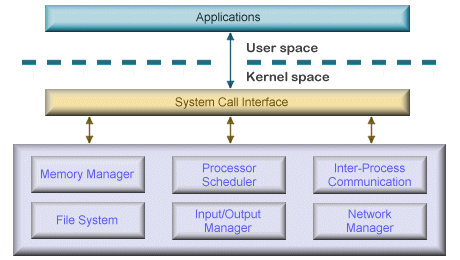

# 🌐 OS?
- Operating System(운영체제)는 **컴퓨터 자원을 관리해주는 프로그램**을 의미합니다.
- 여기서 자원이란 넓은 개념으로, 화면을 보여주는 모니터와 같은 하드웨어부터 심심함을 달래기 위해서 플레이하는 게임 같은 소프트웨어를 포함한 모든 것을 의미합니다. 
- 우리가 어떤 장치를 사용하거나 어떤 게임을 해도 내부적으로 **어떻게 동작하는지 자세하게 알지 않아도 컴퓨터는 잘 돌아갑니다**. 
- 따라서, 정리하면 OS는 **컴퓨터를 보다 쉽게 사용할 수 있도록 도와주는 하나의 인터페이스**입니다.

## 🎯 OS의 목적
- 앞서 언급한 것처럼 OS의 목적인 **자원을 잘 관리**하기 위해서 다음과 같은 기능을 수행합니다.
  1. 자원 관리 : 자원을 응용 프로그램에게 분배·회수한다.
  2. 자원 보호 : 비정상적인 작업(다른 영역 침범 등)을 방지한다.
  3. 하드웨어 인터페이스 제공 : 드라이버를 자동 설치함으로 하드웨어 상관없이 사용 가능하도록 한다.
  4. 사용자 인터페이스 제공 : 사용자가 운영체제를 편리하게 사용할 수 있게 한다.

## 🚑 OS의 구조
- OS는 크게 커널, 인터페이스, 시스템 콜, 드라이버 이렇게 4개로 구성되어 있습니다. 

#### 1. 커널 (Kernel)
- 자동차로 비유하면 OS는 자동차 자체를 **커널은 엔진을 의미**합니다. 이름 자체도 `핵심`을 의미합니다.
- `프로세스`, `메모리`, `파일 시스템`, `I/O`, `프로세스 간의 통신`을 관리합니다.

#### 2. 인터페이스 (Interface)
- 우리가 일반적으로 아는 인터페이스와 역할이 동일합니다. **명령을 커널에 전달하고 결과를 사용자에게 전달**합니다.
- 가장 대표적인 예는 GUI(Graphical User Interface)와 CLI(Command Line Interface)입니다.

#### 3. 시스템 콜 (System Call)
- **커널을 보호**하기 위해서 만든 인터페이스입니다. 직접적인 접근을 막아 보호합니다.

#### 4. 드라이버 (Driver)
- **커널과 하드웨어와의 인터페이스**를 의미합니다.
- 일반적으로 하드웨어를 만든 제공 측에서 드라이버를 제공합니다.

## 💡 커널의 구조
- 앞서 언급한 것처럼 커널의 역할은 `프로세스 관리`, `메모리 관리`, `파일 시스템 관리`, `I/O 관리`, `프로세스 간 통신 관리`입니다.
- 커널은 다음과 같은 다양한 버전이 존재합니다.
  1. 단일 구조 : 기능적으로 분리되지 않은 구조의 커널입니다. 통신 비용이 저렴하지만 에러를 찾기 힘들고 전파 범위가 넓습니다. 또한 수정이 어렵습니다.
  2. 계층형 구조 : 오늘날의 OS의 기본 구조입니다. **계층적으로 기능을 분리**해서 효과적으로 에러에 대응할 수 있습니다.
  3. 마이크로 구조 : 가장 기본적인 기능(커널)만 제공하고 그 외에는 사용자에게 맡기는 구조입니다. **높은 이식성**을 가진다는 특징이 존재합니다. 
