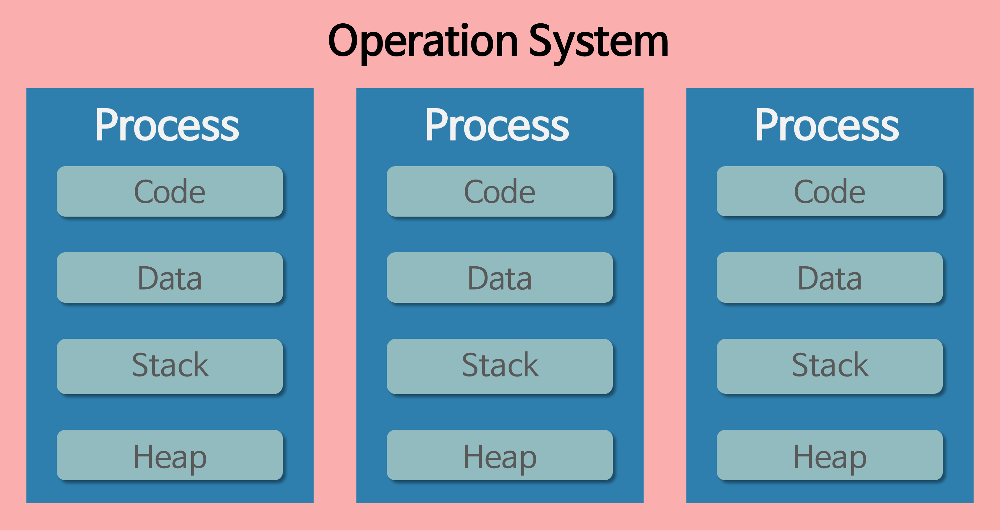
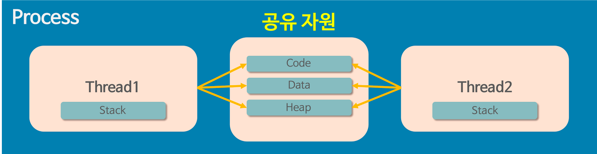

# 👻 Process vs Thread
- 프로세스와 쓰레드는 모두 하나의 `작업 단위`를 의미합니다. 
- 요리를 하기 위해서 주방이라는 공간이 필요한 것처럼 모든 작업에는 공간이 필요합니다. 프로세스와 쓰레드 모두 공간이 필요한데 둘의 차이는 여기서 시작됩니다.

## 💾 프로세스, Process
- 프로세스란, **메모리에서 실행 중인 프로그램**을 의미합니다. 여기서 프로그램이란 **메모리에 올라갈 수 있는 명령어의 집합**으로 동적인 개념을 나타냅니다.
- 프로세스는 **OS로부터 독립된 공간을 할당** 받습니다. 이 공간은 `Code`, `Data`, `Stack`, `Heap` 4영역으로 구분되며 각각 다음 역할을 가지고 있습니다.
  - Code : 명령어들이 기계어로 저장된 공간. CPU가 해당 영역의 명령어를 하나씩 처리한다.
  - Data : 전역 변수와 정적 변수가 선언된 공간. 프로그램의 생명주기와 동일하다.
  - Stack: 함수의 지역변수, 매개변수 등이 저장되는 공간. 함수의 생명주기와 동일하다.
  - Heap : 이외의 데이터를 위한 자유 공간. 사용자에 의해서 동적으로 할당된다.
- **서로 독립적인 공간**을 가지고 있기 때문에 프로세스 간에 소통을 위해서는 파이프, 파일, 소켓 등의 IPC를 사용해야 합니다.
- 기본적으로 프로세스는 **하나 이상의 쓰레드**를 가집니다.

## 🧵 쓰레드, Thread
- 쓰레드란, **프로세스 내의 여러 흐름**을 의미합니다.
- 쓰레드는 **프로세스로부터 작업할 공간을 할당**받습니다. 서로 분리된 프로세스와 다르게 쓰레드는 **부분적으로 자원을 공유**합니다.
- `Stack`과 `PC`를 부여받고 프로세스 내에서 요구한 흐름을 수행합니다.

### 🤔 쓰레드는 왜 필요할까?
- 프로그램이 다양해지고 크기가 점차 커지면서 여러 프로그램을 실행시키는 것은 엄청난 부담을 의미합니다.
- 또한, 매우 작은 프로그램인데 자주 실행되야 한다면 매번 공간을 할당해주고 회수해야만하는 OS은 또 부담이 될 수 밖에 없습니다.
- 이렇게 **더 작은 수행 단위와 비용의 필요성에 의해서 쓰레드가 등장**하게 되었습니다.

### 🗂️ 멀티 프로세스
- 어떤 프로그램을 **여러 프로세스를 한번에 띄우는 것**을 멀티 프로세스이라고 합니다.
- 이 방식은 **어떤 특정 프로세스가 문제가 생겨도 문제가 전파되지 않는 장점이 존재**합니다. 하지만 프로세스를 메모리에 올리는 것은 많은 비용을 의미합니다. 
- 또한, `Context Switching`의 비용이 멀티 쓰레드 환경보다 높으며 프로세스 간에 통신하기 위해서는 추가적인 기술이 필요합니다.
> 💡 Context Switching : 이전 작업의 상태를 보관하고 다른 작업을 수행하는 행위

### 🛎️ 프로세스 통신하기
- 프로세스끼리 통신하는 방법을 IPC(Inter-Process Communication)라고 부릅니다.
- 독립된 프로세스끼리 통신을 하기 위해서 만들어졌고 커널에서 제공합니다. 
- IPC를 구현하는 방법은 다음과 같이 존재합니다.
  - 익명 Pipe : **단방향**으로 이루어진 파이프를 통해서 두 프로세스가 통신한다.
  - Named Pipe : **이름이 있는 파일을 사용**해서 단방향으로 통신한다. `익명 Pipe`와 다르게 `Named Pipe`는 특정한 통신 대상이 존재하지 않는다.
  - Message Queue : **Queue를 이용**한다. 하나의 메모리 자체 즉, 컨테이너 벨트와 동일하다.
  - Shared Memory : **메모리 자체를 공유**한다. IPC 중에서 가장 빠르다.
  - Memory Map : `Shared Memory`와 비슷하다. 열린 파일을 매핑해서 공유한다.
  - Socket : 소켓 통신을 활용한다.
  - Semaphore : 프로세스 간의 데이터 동기화를 위한 IPC이다. 많은 프로세스의 접근을 막는 방법이다.
- 다양한 방법을 지원해도 **레지스터의 교환 외에도 캐시까지 초기화되기 때문에 여전히 비용 부담은 존재**합니다. 

### 🧬 멀티 쓰레드
- **한 프로세스 내에서 여러 쓰레드를 사용해서 작업을 처리하는 것**을 멀티 쓰레드라고 합니다.
- 멀티 프로세싱보다 `Context Switching`의 비용 낮으며 자원을 일부 공유하기 때문에 통신 비용이 훨씬 적습니다.
- 하지만, 자원을 공유한다는 것은 반대로 **어떤 쓰레드가 문제를 일으키면 프로세스 자체에 문제**가 발생할 수 있고, 경우에 따라 동기화로 인한 문제가 발생합니다.
