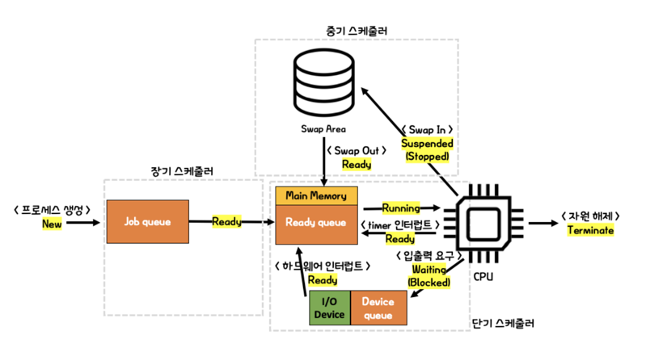
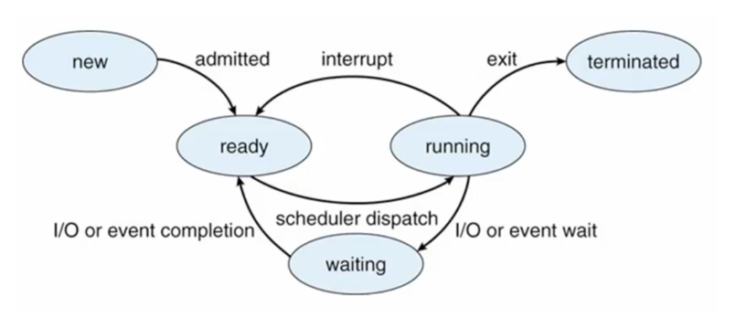

# 📅 스케줄러, Scheduler
- 교통 상황이 복잡하다면 교통 경찰이 교통의 흐름이 원활하게 진행될 수 있도록 도와줍니다.
- 프로세스에서도 여러 프로세스가 동작한다면 **원활하게 교차해서 동작할 수 있도록 도와줄 누군가**가 필요합니다. 이 역할을 담당하는 것이 바로 스케쥴러입니다.
- 스케줄러란, **어떤 프로세스에게 자원을 할당할지 결정**하는 `운영체제의 커널 모듈`입니다.

## 💈 스케줄러 큐
- 프로세스는 종료될 때까지 다양한 대기열에서 자기 순번을 기다리는데 이 대기열을 `스케줄러 큐`라고 합니다.
- 대표적인 스케줄러 큐는 다음과 같이 세 종류가 있습니다.
> Job Queue : 시스템 내부 모든 프로세스들의 큐  
> Ready Queue : CPU 할당 대기 중인 프로세스들의 큐  
> Device Queue(I/O Queue) : 입출력 작업을 대기 중인 프로세스들의 큐

## 🧵 스케줄러 종류
- 프로세스마다 크기, 우선 순위 등 가지고 있는 상태가 다르므로 **스케줄러도 종류를 나누어 관리**합니다.  

### 1️⃣ 장기 스케줄러(Job Scheduler)
- `메모리와 디스크 사이를 담당`하는 스케줄러입니다.
- 작업 큐에서 대기 중인 `프로세스를 준비 상태로 메모리에 올리는 역할`을 수행합니다.
- 그리고 메모리에 올라온 `프로세스의 수를 제어`합니다.
- 과거에는 메모리의 크기가 작기 때문에 많은 프로세스에 할당할 수 있는 메모리의 양이 적었습니다. 
- 이 문제를 해결하기 위해서 많은 메모리를 차지하는 프로세스는 디스크에 임시 저장하였고, 임시 저장된 프로세스 중에서 선택해서 메모리로 올리는 역할을 수행했습니다. 
- 오늘날의 운영체제는 **시분할 프로그래밍을 사용해서 장기 스케줄러를 사용하지 않습니다**. 즉, **모든 프로세스가 Ready 상태로 바로 메모리에 올라갑니다**.

> 💡 시분할 프로그래밍?
> 
> 운영체제에서 각 프로세스마다 일정 시간 동안 CPU를 할당하는 방식.  
> 멀티 프로그래밍과 다르게 `응답 시간을 최소화`하는 것이 목적입니다.

### 2️⃣ 중기 스케줄러(Swapper)
- 불필요하게 메모리를 차지하고 있는 `프로세스를 청소`하는 스케줄러입니다.
- 모종의 이유로 `Ready` 상태에서 `Running`으로 넘어가지 못한 프로세스를 청소하여(Swap In) `Suspended` 상태로 변환합니다.

### 3️⃣ 단기 스케줄러(CPU Scheduler)
- CPU와 메모리 사이를 담당하는 스케줄러입니다.
- 준비 큐에 대기 중인 프로세스 중 `어떤 프로세스가 CPU를 할당받을 지 결정`합니다.
- 단기 스케줄러는 단순히 프로세스를 선택하고, 실제로 프로세스를 CPU에 할당하는 것은 `Dispatcher`가 수행합니다.

> 💡 Dispatcher
>
> 단기 스케줄러 내부에서 실제로 프로세스를 CPU에 할당해주는 역할을 수행.  
> 다른 프로세스로 교체하는데 걸리는 시간을 `Dispatch Latency`라고 합니다.

## 🧬 프로세스의 상태
- 프로세스의 상태에 따라서 스케줄러가 요청을 처리합니다.
- 스케줄러가 작업하기 위해서는 프로세스의 상태를 포함한 다양한 정보가 필요한데, 이 정보의 집합을 `PCB`라고 합니다.

### 🧱 PCB (Process Control Block)
- 프로세스의 모든 정보가 모여있는 곳으로 TCB(Task Control Block)이라고도 부릅니다.
- 프로세스의 상태, 프로세스의 번호(PID), PC, CPU 점유 시간 등 다양한 정보를 가지고 있습니다.
- `Context Switching`이 발생할 때 **PCB의 정보를 업데이트하고 다음 작업으로** 넘어갑니다.

## 😋 스케줄링, Scheduling
- <u>운영체제에서 스케줄러를 통해서 프로세스 사이의 우선 순위를 관리하는 작업</u>을 `스케줄링`이라고 부릅니다.

### 🤔 언제 스케줄링이 발생하나요?
- 스케줄링을 다르게 표현하면 `작업 대상을 고르는 작업`을 의미합니다. 즉, 작업 대상이 변경될 때 스케줄링이 발생합니다.
- 일반적인 상황을 정리하면 다음과 같습니다.
> 1. `Running` -> `Ready` (`Interrupt` 발생)  
> 2. `Running` -> `Waiting` (`I/O` 요청)  
> 3. `Waiting` -> `Ready` (`I/O` 종료)  
> 4. `Terminated`

### 👻 스케줄링의 종류
- 어떻게 CPU를 점유하고 있는가에 따라서 스케줄링은 두 종류로 나뉩니다.
- 두 스케줄링은 `스스로 CPU를 반납할 수 있는가?`에서 차이를 가집니다.

#### 1️⃣ 비선점 스케줄링
- 한번 CPU가 할당되면 다른 프로세스가 선점할 수 없는 스케줄링 방식입니다.
- 스스로 CPU를 반납할 때까지 기다려야만 다음 작업을 수행할 수 있기 때문에 **어떤 프로세스의 작업 시간이 길다면 처리율이 떨어집니다**.

#### 2️⃣ 선점 스케줄링
- 더 높은 우선순위를 가진 프로세스가 선점할 수 있는 스케줄링 방식입니다.
- 잦은 `Context Switching`이 발생한다면 많은 오버헤드가 발생할 수 있습니다.

##### FCFS (First-Come-First-Served) 알고리즘
- 일반적인 큐의 방식을 따르는 `비선점 스케줄링 알고리즘`입니다.. (FIFO)
- **작업 시간이 긴 프로세스에 의해서 많은 프로세스가 기다리는 현상**을 `Convoy Effect`라고 부릅니다.

##### SJF (Short-Job-First) 알고리즘
- 가장 짧은 작업 시간을 가지는 프로세스에게 CPU를 할당하는 알고리즘입니다.
- 선점 스케줄링(`Short-Remainig-First`)에서는 계속 짧은 프로세스가 들어오면 `Starvation`이 발생할 수 있습니다.
- `Starvation`의 해결책으로 `Aging`으로 해결할 수 있습니다.

> 💡 기아 현상, Starvation
> 
> 특정 프로세스가 우선 순위가 밀려 영원히 CPU를 점유하지 못하는 현상 

> 💡 Aging
>
> `Starvation`을 방지하기 위한 방법으로 기다린 시간(혹은 양보한 회수)로 우선 순위를 높이는 방법

##### RR (Round-Robin) 알고리즘
- 모든 프로세스가 `동일한 작업 시간을 가지고 CPU를 점유`하는 알고리즘입니다.
- 동일한 시간 내에 작업을 마무리하지 못하면 마지막 순서로 돌아갑니다.
- 부여되는 `작업 시간`에 따라 성능이 좌우됩니다. 너무 시간이 적다면 `Context Switching` 비용이 올라가고, 많다면 우선 순위 문제가 발생할 수 있습니다. 
