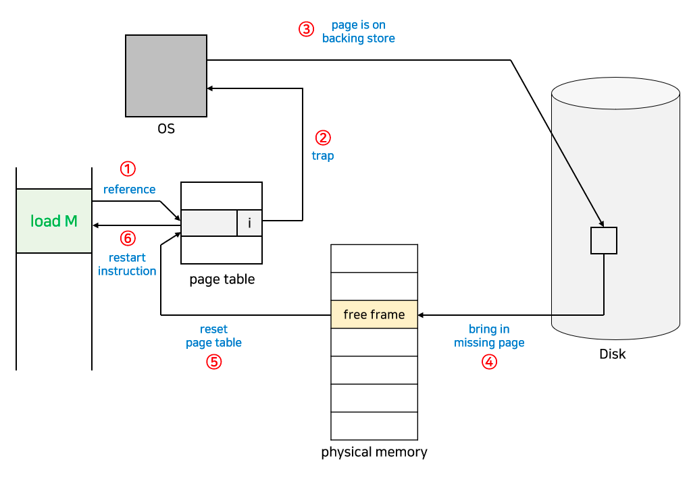
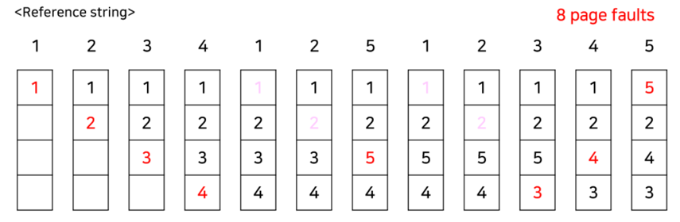
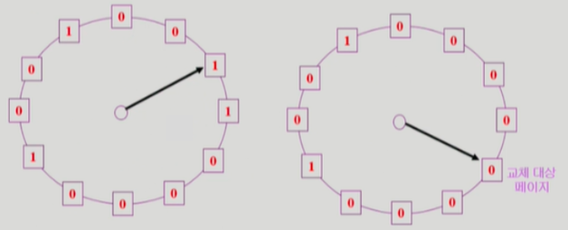

# 가상 메모리
- 기존에는 **메모리의 한계** 때문에 용량이 크거나 여러 프로세스를 한번에 실행시키지 못했습니다.
- 실제로는 메모리에 올린 **코드의 일부만 사용**하거나 생각보다 **적은 양의 메모리만을 사용**했기 때문에 매우 비효율적이었습니다.
- 가상 메모리란, `물리적 메모리의 한계를 해결`하기 위해 등장한 기술입니다. 실제로 필요한 일부만 메모리에 로드하고 나머지는 저장소에 둡니다.

## 요구 페이징, Demand Paging
- 가상 메모리를 통해서 실제로 더 많은 메모리를 사용할 수 있게 되었습니다.
- 이때, 현재 필요한 데이터만 메모리에 올리는 것을 `Demand Paging`이라고 합니다.
- 더 많은 메모리를 사용할 수 있기 때문에 더 많은 프로세스를 처리 즉, CPU 이용률이 높아집니다.
-  `valid-invalid bit`를 활용해서 현재 물리 메모리에 있는 지 확인합니다.
> 💡 존재 비트(valid-invalid bit)는 Page Table에 저장되어 있다.

- 실제 주소로 변환하는 절차는 다음과 같습니다. (그림 참고)
  1. 가상 주소가 주어지면 `TLB` 확인
     - hit : 주소 반환 (end)
     - miss : page table 확인 (next)
  2.  `valid-invalid bit` 확인
     - valid : 주소 변환 및 TLB 갱신 (end)
     - invalid : page fault 오류 발생 (next)
  3. `MMU(memory manage unit)`가 OS에 trap을 걸고 page fault hanlder 호출
  4. 유효한 프로세스라면 page 참조를 가져와 디스크에서 메모리로 로드, 아니라면 프로세스 종료
     - 페이지를 넣을 공간(page frame)을 찾다가 없다면 [페이지를 교체](#page-replacement-algorithm)합니다.
  5. 성공적으로 로드 시 page table, bit 갱신
- 요구 페이징의 성능은 page fault가 얼마나 적게 발생하는지 달려 있습니다.

## Page Replacement Algorithm
- 요구 페이징에서 page가 존재하지 않을 때, 기존에 저장되어있는 **페이지 교체 알고리즘** 입니다.

### 1️⃣ OPT(Optimal Algorithm)
- **가장 먼 미래에 사용할 페이지**를 대체하는 방법입니다.
- 가장 최적의 결과를 만들어내지만 모두 예측할 수 없기 때문에 실제로 사용하긴 어렵습니다.

### 2️⃣ FIFO
- **가장 먼저 들어온 페이지**를 교체하는 알고리즘입니다.
- 모든 페이지가 공평한 시간을 가질 수 있습니다. 하지만 매번 사용되는 페이지도 교체해버릴 수 있다는 단점이 존재합니다.
- 따라서, 프레임이 늘어나도 오히려 page fault가 증가하는 `Belady's anomaly` 현상이 발생할 수 있습니다.

### 3️⃣ LRU(Least Recently Used)
- **가장 오래 전에 참조된 페이지**를 교체하는 알고리즘입니다.
- 가장 최근에 교체한 페이지를 앞에 배치시키는 방법으로 구현할 수 있습니다. (가장 오래된 페이지 = 마지막 노드)

### 4️⃣ LFU(Least Frequently Used)
- **가장 참조 회수가 적은 페이지**를 교체하는 알고리즘입니다.
- LRU와 같이 연결 리스트로 구현하면 탐색 시간에 `O(n)`이 걸려서 힙 구조로 구현합니다.
- page가 얼마나 참조되었는 지에 따라 교체되기 때문에 시간 지역성을 보장할 수 없습니다.

### 5️⃣ Second Chance Algorithm (Clock Algorithm)
- LRU를 개선한 알고리즘으로 시간 지역성을 따집니다.
- 추가 정보(Reference bit)를 사용하는데, 시계처럼 페이지를 돌면서 확인하고 지금 확인하는 페이지가 교체 대상이라면 (0 이라면) 교체합니다.

