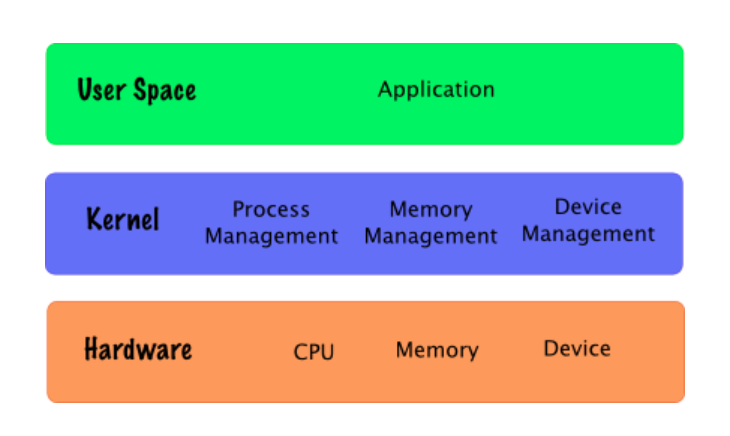
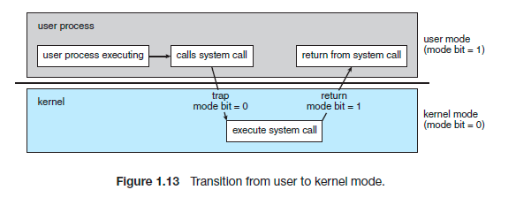

# ⚙️️ 커널, Kernel
- `핵심`을 의미하며 자동차로 비유하면 **엔진과 같은 존재**입니다.
- `OS`는 사용자 대신 컴퓨터의 모든 자원을 관리해주는데, 크게 커널과 시스템 프로그램으로 분리될 수 있습니다.
- 자동차를 움직이는 **핵심은 엔진이지만 운전자와 직접적인 상호작용이 없는 것처럼 커널도 동일**합니다.

## 🤔 커널은 무엇을 하나요?
- 운영체제의 핵심 부분인 커널은 메모리에 항상 올라와선 **자원을 관리**를 담당합니다.
- 커널인 관리하는 자원은 `물리적 자원`과 `추상화 자원`으로 구분할 수 있습니다.
- 추상화 자원이란, 물리적으로는 하나뿐인 하드웨어를 여러 요청을 수행할 수 있도록 **여러개처럼 보이도록 하는 기술**을 의미합니다.
  - CPU <-> Process
  - Memory <-> Page, Segment
  - Disk <-> File
  - Network <-> Socket
- 추상화 자원을 통해서 `프로세스`, `메모리`, `파일 시스템`, `I/O` 등을 관리하면서 **인터럽트 핸들링도 담당**합니다.

## 🪟 인터페이스로써 커널
- 인터페이스란 두 대상 경계에서 원활한 작동을 도와주는 것입니다. 커널도 인터페이스의 한 종류입니다.
- 커널의 구성 요소들이 존재하는 공간을 `커널 스페이스`라고 합니다.
- `커널 스페이스` 위에 유저 공간이 있으며 여기에 프로세스가 존재합니다.

- 각 공간 사이에 또 하나의 인터페이스가 존재하는데, 이를 `시스템 콜` 인터페이스라고 부릅니다.
- 유저 공간의 프로세스가 커널이 관리하는 자원에 접근해야할 필요가 있을 때 **시스템 콜을 통해서 요청을 전달**합니다.
- 따라서, 커널은 **시스템 콜을 통해 컴퓨터 자원을 관리**하는 자원 관리자입니다.

### 🤙 System Call
- 사용자 공간(User space)에서 실행되는 프로그램이 **운영 체제의 서비스(커널)를 요청하기 위해 사용하는 인터페이스**입니다.
- 유저 레벨에서 모든 기능을 처리할 수 없기 때문에 커널의 도움을 받아서 처리해야할 때가 있습니다.
- 이때, 커널과 관련된 모든 것은 `커널 모드`일 때 작업을 수행할 수 있습니다. 
- 따라서, **유저 모드에서 커널에 작업을 요청하기 위해서 커널 모드로 전환시키는 요청**이라고도 볼 수 있습니다.

### 🧐 왜 System Call이 필요할까?
- 하나의 인터페이스라는 점을 기억하면 쉽습니다. 
- 직접적인 접근을 막았기 때문에 안전하고 프로그램 간의 충돌을 제어할 수 있는 기틀이 마련됩니다. 또한, 복잡한 저수준을 직접적으로 사용하지 않아도 됩니다.

### 🧐 유저 모드? 커널 모드?
- 시스템에서 **프로세스가 실행되는 환경을 모드**라고 합니다. 두 모드는 다음과 같습니다.
  - 유저 모드 : 유저 영역에 위치한 프로세스로 제한된 권한을 가진다. 하드웨어나 시스템 자원에 직접적인 접근을 하기 위해서는 시스템 콜을 활용해야 한다.
  - 커널 모드 : 커널 영역에 위치한 프로세스로 모든 권한을 가진다.

## Reference
- https://fjvbn2003.tistory.com/306
