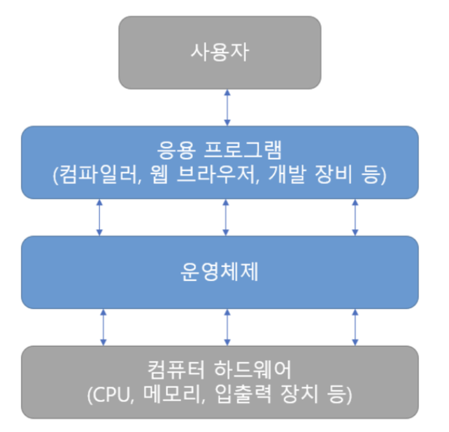
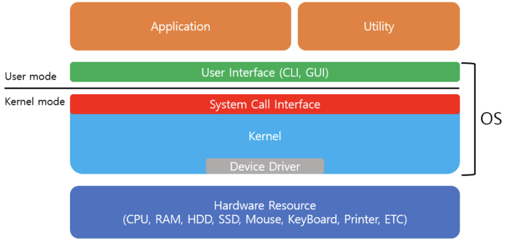
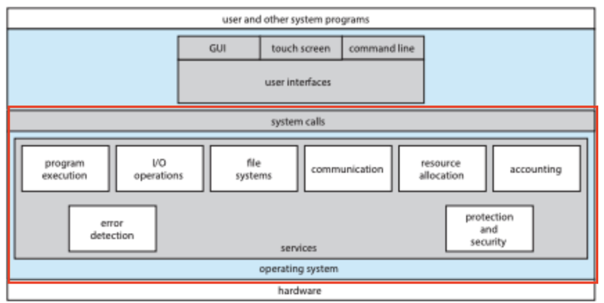

# 운영체제란 무엇인가?

태그: CS, 운영체제

# 운영체제란

사용자와 하드웨어 사이의 인터페이스 역할과 하드웨어 자원을 관리하는 소프트웨어입니다.

프로그램이 실행되기 위해서 CPU, 메모리, IO 같은 하드웨어 자원이 필요합니다.

운영체제는 사용자가 크롬과 같은 응용 프로그램을 사용할 때 하드웨어 자원을 할당해주어 실행되도록 합니다.

# 운영체제 구성요소

운영체제는 크게 인터페이스와 커널로 구성되어있습니다.

## 인터페이스

인터페이스는 사용자와 운영체제가 소통할 수 있는 수단입니다.

사용자는 인터페이스를 통해 작업을 수행하고, OS 는 인터페이스에서 발생한 이벤트에 맞춰 동작합니다.

인터페이스의 종류는 다양합니다.

리눅스 계열의 bash-shell 같은 CLI 도 있고, pc용 window GUI 도 있습니다.

## 커널

커널은 운영체제의 기능을 수행하는 프로그램입니다.

프로세스 관리, 메모리 관리, 저장공간 관리, 연결된 장치 관리 등 요청에 필요한 하드웨어를 관리합니다.

커널은 시스템 콜 API 를 통해 응용프로그램과 소통합니다.

커널 프로그램에 대한 응용프로그램의 직접 접근을 제한함으로써 커널을 보호합니다.

커널은 디바이스 드라이버를 통해 외부 하드웨어와 소통합니다.

그래픽카드, 프린터등의 외부장치를 연결할 때 해당 하드웨어의 디바이스 드라이버를 통해 연결됩니다.

# 운영체제 역할

운영체제의 역할은 커널이 제공하는 서비스와 동일합니다.

## 커널이 제공하는 주요 서비스

1️⃣ **프로세스 관리**

운영체제는 실행 중인 응용 프로그램인 프로세스(Process)를 관리한다. 여기서 프로세스의 생성, 실행, 일시 정지, 시스템 중지 등의 작업을 제어하며, 여러 프로세스 간의 자원 공유와 협력을 관리한다.

**2️⃣ 메모리 관리**

운영체제는 컴퓨터의 메모리를 효율적으로 관리하여 응용 프로그램이 필요로하는 메모리 공간을 할당한다. 여기서 메모리의 할당과 해제, 가상 메모리 관리 등을 포함한다.

3️⃣ **디스크 및 파일 시스템 관리**

운영체제는 디스크와 파일 시스템을 관리하여 파일의 생성, 삭제, 복사, 이동 등의 작업을 처리한다. 파일 시스템은 데이터의 영구적인 저장과 접근을 제공하여 사용자 및 응용 프로그램이 데이터를 쉽게 관리할 수 있도록 한다

4️⃣ **입출력 관리**

운영체제는 입출력 장치와의 상호작용을 관리한다. 사용자와 응용 프로그램이 키보드, 마우스, 디스플레이, 프린터 등과의 통신을 할 수 있도록 지원하며, 입출력 장치의 성능을 최적화 한다.

5️⃣ **네트워킹**

운영체제는 컴퓨터 네트워크를 관리하고, 네트워크 프로토콜을 지원하여 컴퓨터 간의 통신을 가능하게 한다. 인터넷 연결, 데이터 전송, 네트워크 보안 등을 관리한다

# 참고자료

[[운영체제] 운영체제(OS)란?](https://jerryjerryjerry.tistory.com/171)