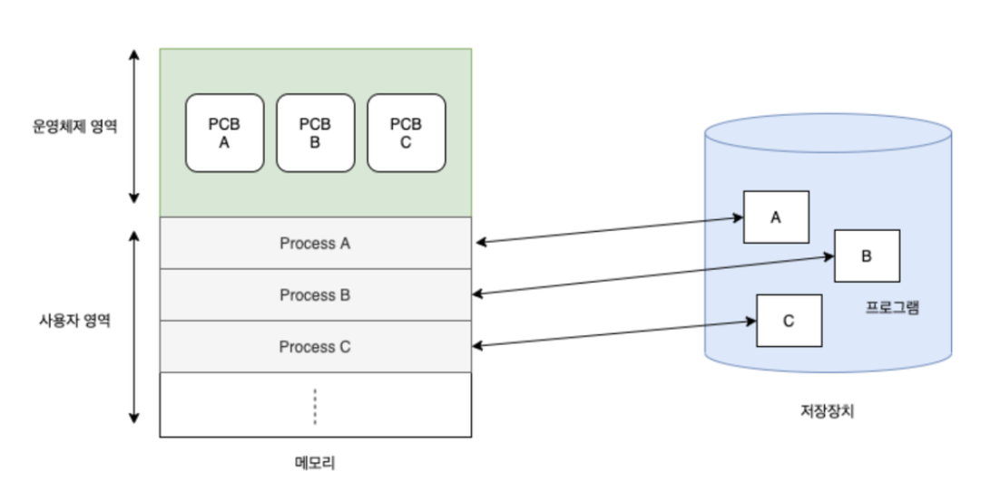

# 프로세스와 스레드

태그: CS, 운영체제

# 프로세스

## 프로세스란

프로세스는 실행되고 있는 프로그램입니다.

코드 파일인 프로그램이 메모리와 cpu 를 할당받아 동작하는 것을 의미합니다.

프로세스는 또한 운영체제가 자원을 할당하고 관리하는 단위입니다.

운영체제는 프로세스가 생성될 때 PCB 자료구조를 통해 작업을 관리합니다.

## 프로세스 메모리 영역

프로세스는 독립적인 메모리를 할당받습니다.

메모리는 code, data, stack, heap 영역으로 나뉘어 관리됩니다.

| code: | 컴파일된 소스 코드가 저장되는 영역 |
| --- | --- |
| data | 전역 변수/초기화된 데이터가 저장되는 영역 |
| stack | 임시 데이터(함수 호출, 로컬 변수 등)가 저장되는 영역 |
| heap | 코드에서 동적으로 생성되는 데이터가 저장되는 영역 |

## 프로세스 특징

프로세스는 스레드 라는 실행 단위에 의해 실행됩니다.

따라서 프로세스는 한 개 이상의 스레드 에 의해 실행되고 최초의 한개를 메인 스레드 라고 합니다.

프로세스는 자원을 공유하지 않습니다.

프로세스는 독립된 메모리 영역을 할당 받기 때문입니다.

다른 프로세스의 자원에 접근하기 위해선 IPC 라는 별도의 작업을 수행해야 합니다.

# 스레드

## 스레드란

스레드는 프로세스 내의 작업 실행 단위입니다.

프로세스가 자원 할당 단위라면 받은 자원을 사용해서 동작하는 실행 단위 입니다.

운영체제는 TCB를 통해 스레드를 관리하는데, 이는 PCB 내부에 존재합니다.

이를 통해 컨텍스트 스위칭시 스레드가 프로세스보다 비용이 적음도 알 수 있습니다.

## 스레드 특징

stack 영역을 가집니다.

stack 영역은 함수 호출과 관련된 정보를 다루는 데이터 영역으로 작업 흐름과 관련 있습니다.

스레드는 실행 단위이기 때문에 작업을 위한 stack 메모리가 필요합니다.

PC 레지스터를 가집니다.

PC 레지스터는 다음 실행할 명령어의 주소값을 저장하는 공간입니다.

스레드는 PC 레지스터가 있어야 작업을 수행할 수 있습니다.

같은 프로세스내 스레드 끼리 자원 공유 할 수 있습니다.

스레드는 stack 영역만 별도로 할당받고 프로세스의 나머지 데이터 영역을 공유합니다.

데이터 영역을 공유하기 때문에 메모리를 효율적으로 사용하고 슬레드간 통신 비용을 줄일 수 있습니다.

자원을 공유하기 때문에 공유자원에 대한 동기화가 필요합니다.

동기화가 되지 않을 때 데이터 무결성이 깨지거나 데드락 문제가 발생할 수 있습니다.

## 자바로 알아보는 프로세스 스레드

자바 프로그램은 JVM에 의해 동작합니다.

이때 JVM은 하나의 프로세스로서 운영체제로부터 실행에 필요한 자원을 할당받습니다.

자바 프로그램은 메인 메서드에 의해 실행됩니다.

이를 실행하는 단위가 프로세스 내의 메인 스레드 입니다.

정리하면 자바 프로그램의 실행은 JVM 프로세스에서 메인스레드가 메인 메서드를 실행하는 것을 의미합니다.

# 참고자료

[[Operating System] 프로세스의 개요, 상태](https://math-coding.tistory.com/98)

[[OS] 프로세스와 스레드의 차이 - Heee's Development Blog](https://gmlwjd9405.github.io/2018/09/14/process-vs-thread.html)